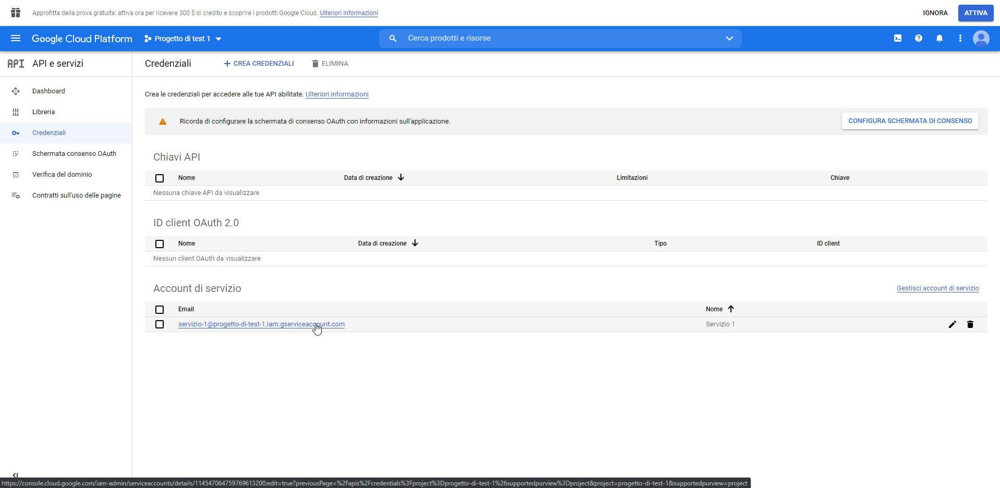
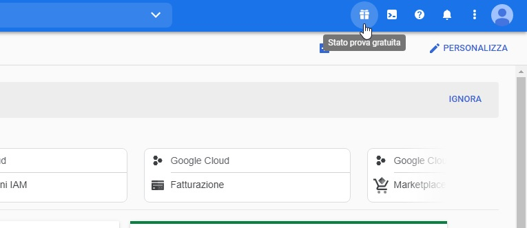

.. |dashboard| image:: ../../../images/ABot/google_cloud_platform_dashboard.jpg
.. |ApiEServizi| image:: ../../../images/ABot/google_cloud_platform_ApiEServizi.jpg
.. |roleSelect| image:: ../../../images/ABot/google_cloud_platform_account_role_select.jpg

.. _creazione account di google: https://accounts.google.com/signup/v2/webcreateaccount?continue=https%3A%2F%2Fwww.google.it%2F&hl=it&dsh=S251938807%3A1613575646693186&gmb=exp&biz=false&flowName=GlifWebSignIn&flowEntry=SignUp
.. _Google Cloud Platform: https://console.cloud.google.com/projectselector2/home/dashboard?supportedpurview=project
=====================
Configurazione Google
=====================

Per iniziare è necessario possedere un normale account google, il quale è possibile crearlo nell'apposita pagina di `creazione account di google`_.
Una volta creato il proprio account, è possibile configurare il proprio account accedendo alla pagina di `Google Cloud Platform`_, eseguendo i seguenti step:
    - Accedere con il proprio account google se non si è ancora fatto l'accesso.
     |dashboard|
    - Selezionare **CREA PROGETTO** sulla pagina di dashboard.
    - Inserire un nome di progetto e premere **CREA**.
    - Una volta finita la creazione, selezionare **API e servizi** e poi **Credenziali** dal menu laterale.
     |ApiEServizi|
    - Premere **CREA CREDENZIALI**, selezionare **Account di servizio** ed immettere un nome a scelta e successivamente premere **CREA**.
    - Nella voce **Seleziona ruolo**, scorrere fino alla voce **Progetto**, a fianco selezionare **Proprietario**, premere **CONTINUA** e poi **FINE**.
     |roleSelect|
    - Una volta visualizzata la lista delle credenziali, selezionare l'account appena creato dalla sezione **Account di servizio** della pagina credenziali.
     |accountSelect|
    - Premere su **AGGIUNGI CHIAVE**, **Crea nuova chiave**, selezionare **JSON** e premere **CREA**.
    - Salva il file sul proprio pc in modo tale da poterlo utilizzare in un secondo momento.

A questo punto la configurazione è conclusa e la chiave appena scaricata sarà utilizzata dal TVox per sfruttare i servizi Google.

| Per aggiungere credito all'account è necessario attivare la prova gratuita, premendo sul pulsante **ATTIVA** sulla notifica di attivazione in testa alla pagina.
| La prova gratuita garantisce 300 $ di credito gratuito ma per iniziare bisogna inserire una carta di credito.
| Nel caso la notifica di attivazione non fosse presente, selezionare l'icona "regalo" in alto a destra nella pagina Google Cloud Platform.

|presentButton|