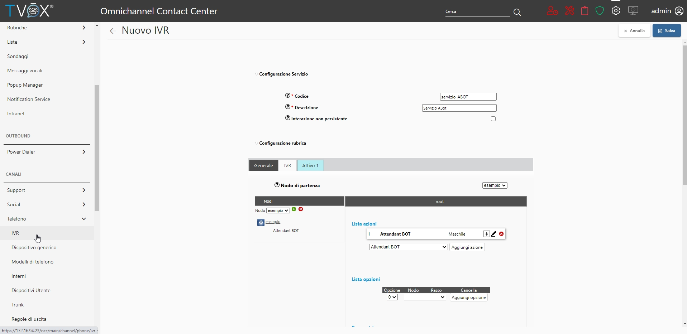

=====================
Configurazione OCC
=====================

| É possibile configurare un servizio IVR con Attendant Bot sotto la sezione **CANALI** → **Telefono** → **IVR** del TVox Omnichannel Contact Center.
| Durante la creazione del servizio, nella tab IVR, è possibile selezionare l'opzione Attendant Bot dalla lista azioni. 
|TVox_Servizio_IVR_con_ABot|

| Una volta aggiunta, verrà proposta una lista di parametri che permettono la customizzazione di alcune caratteristiche del Bot.

Configurazioni aggiuntive
==========================================
 
TVox Attendant Bot richiede le seguenti configurazioni aggiuntive:

- Specificare quali utenti e servizi possono essere interpretati e pronunciati dal TVox Attendant Bot
  
.. warning:: Questa fase della configurazione è ancora in fase di sviluppo. Al momento è necessaria assistenza tecnica.