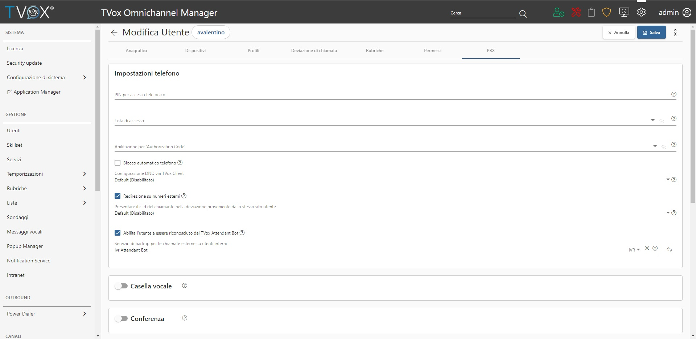

.. |TVox_Servizio_IVR_con_ABot| image:: ../../../../images/ABot/TVox_Servizio_IVR_con_ABot.jpg

=====================
Configurazione OCC
=====================

| É possibile configurare un servizio IVR con Attendant Bot sotto la sezione **CANALI** → **Telefono** → **IVR** del TVox Omnichannel Contact Center.
| Durante la creazione del servizio, nella tab IVR, è possibile selezionare l'opzione Attendant Bot dalla lista azioni. 

|TVox_Servizio_IVR_con_ABot|

| Una volta aggiunta, verrà proposta una lista di parametri che permettono la customizzazione di alcune caratteristiche del Bot.

Abilitare gli agenti ad essere riconosciuti dal TVox Attendant Bot
===================================================================
 
| Per abilitare l'agente è necessario navigare nella sezione PBX durante la modifica dell'utente TVox, e premere sulla voce "Abilita l'utente a essere riconosciuto dal TVox Attendant Bot".
| Inoltre è possibile specificare il servizio a cui un contatto non interno viene trasferito se chiede di parlare con un utente del TVox. 

| Lo scopo è quello di evitare che un agente del TVox possa essere messo direttamente in comunicazione con un contatto esterno attraverso il TVox Attendant Bot, ciò non vale per gli utenti del TVox.

|abot_occ_abilitare_utente_al_riconoscimento|