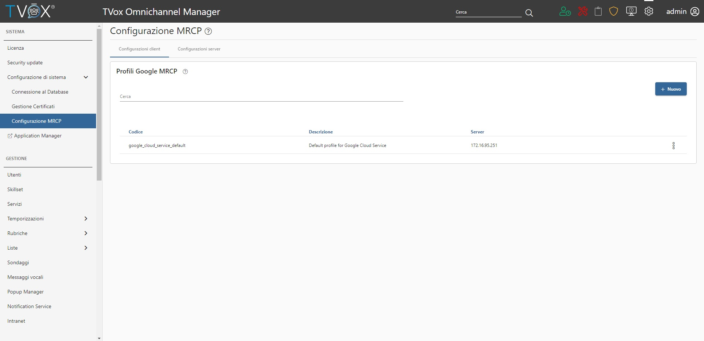

.. |abot_occ_abilitazione_server| image:: ../../../../images/ABot/abot_occ_abilitazione_server.jpg
.. |abot_occ_caricamento_plugin| image:: ../../../../images/ABot/abot_occ_caricamento_plugin.jpg

=====================
Configurazione OCC
=====================

| É possibile configurare un servizio IVR con Attendant Bot sotto la sezione **CANALI** → **Telefono** → **IVR** del TVox Omnichannel Contact Center.
| Durante la creazione del servizio, nella tab IVR, è possibile selezionare l'opzione Attendant Bot dalla lista azioni. 
|TVox_Servizio_IVR_con_ABot|

| Una volta aggiunta, verrà proposta una lista di parametri che permettono la customizzazione di alcune caratteristiche del Bot.

Abilitare gli agenti ad essere riconosciuti dal TVox Attendant Bot
==========================================
 
| Per abilitare l'agente è necessario navigare nella sezione PBX durante la modifica dell'utente TVox, e premere sulla voce 
"Abilita l'utente a essere riconosciuto dal TVox Attendant Bot".
| Inoltre è possibile specificare il servizio a cui un contatto non interno viene trasferito se chiede di parlare con un utente del TVox. 
| Lo scopo è quello di evitare che un agente del TVox possa essere messo direttamente in comunicazione con un contatto esterno attraverso il TVox Attendant Bot, 
ciò non vale per gli utenti del TVox.

|abot_occ_abilitare_utente_al_riconoscimento|

Configurazione del server MRCP
==========================================

| Il server MRCP è necessario per effettuare richieste di sintesi e riconoscimento vocale verso Google, ed è possibile abilitarlo 
| nella sezione **Sistema** → **Configurazione MRCP** → **Configurazione server**.
| L'abilitazione del server richiede la presenza della chiave google ( file json ) e di almeno uno dei due plugin MRCP caricabili nella stessa pagina.

|abot_occ_abilitazione_server|

| La chiave json è ottenibile durante la configurazione di Google Speech Service sulla Google Cloud Platform, mentre i plugin MRCP 
| sono forniti da Telenia Software, dopo aver generato una richiesta di attivazione.
| Questa richiesta è effettuabile tramite il pulsante "Genera Richiesta" nella sezione **Plugin per MRCP**. 
| Subito dopo aver richiesto l'attivazione, verrà scaricato un file contenente le seguenti informazioni di sistema:

- Indirizzo IP
- Indirizzo MAC 
- Hostname

| Queste informazioni sono essenziali in quanto identificano la macchina su cui le licenze sono attivate, di conseguenza assicurarsi che 
| la macchina sia configurata correttamente prima di generare la richiesta.
| Una volta ottenuto il file, è necessario inviarlo a Telenia e successivamente verranno forniti dei file ZIP contenenti i rispettivi plugin MRCP.
| A questo punto ogni zip deve essere caricato nella rispettiva sezione GSR o GSS per abilitare la funzionalità.

|abot_occ_caricamento_plugin|

Note aggiuntive: il server MRCP può risiedere su una macchina differente rispetto a quella che ospita il client MRCP. 

Configurazione dei profili MRCP
=========================================

All'interno dei profili si può configura l'ip del server MRCP che si occupa della gestione delle richieste. In questa sezione è sempre presente un profilo non cancellabile, che è utilizzato come default se profili aggiuntivi non sono stati creati.

.. warning:: L'indirizzo del server corrisponde all'indirizzo IP fisico della macchina che sta ospitando il server MRCP. Se vengono specificati indirizzi IP virtuali le richieste non andranno a buon fine.

Dal momento che il server e il client MRCP possono risiedere in macchine separate, è possibile creare più di un profilo MRCP, e specificare un server diverso.

|abot_occ_pagina_profili|

Fault tolerance
==========================================

| In uno scenario in cui il TVox è ridondato, è possibile eseguire queste configurazioni sia nel caso la macchina sia  master, sia nel caso la macchina sia lo slave.
| Così facendo è possibile abilitare i server MRCP su entrambe le macchine, in modo tale che nel caso di fallimento del master, 
| lo slave è già pronto a gestire le nuove richieste. Da un punto di vista configurativo, significa che entrambe le macchine devono disporre degli stessi profili MRCP ( Con gli stessi identificativi ), con la differenza che gli indirizzi ip puntano al proprio server.
| Questo tipo di configurazione richiede la presenza di plugin MRCP diversi su entrambe le macchine, dato che i plugin sono forniti basandosi su indirizzo ip e mac della macchina.
| Nel caso si dispone di plugin MRCP per solo una macchina, è possibile configurare lo slave in modo tale che i profili del client puntino al server MRCP del master. Questo perchè nel caso avvenisse uno switch di nodo, il profilo MRCP rimane operativo e continua a gestire le richieste.