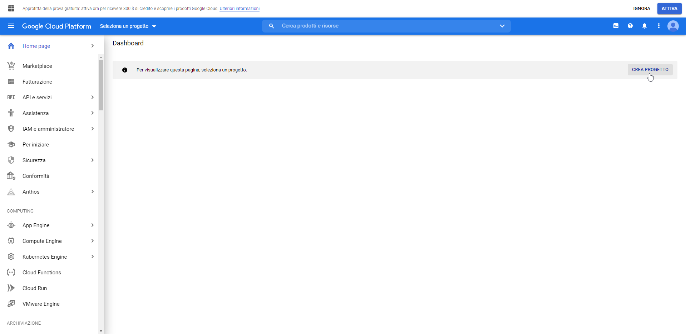
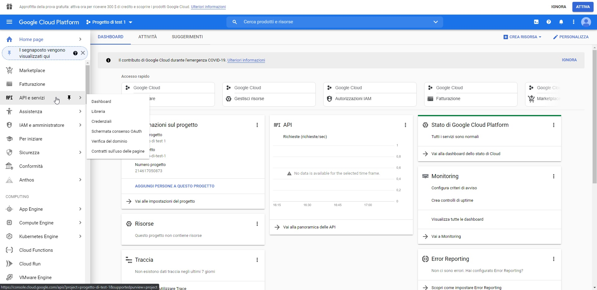
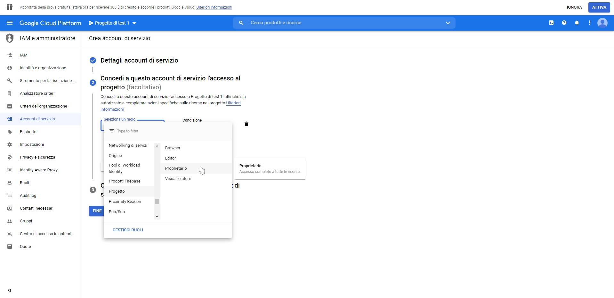
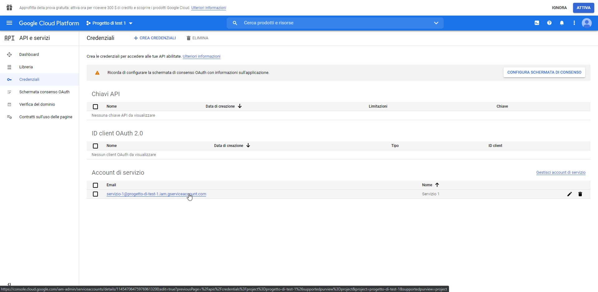
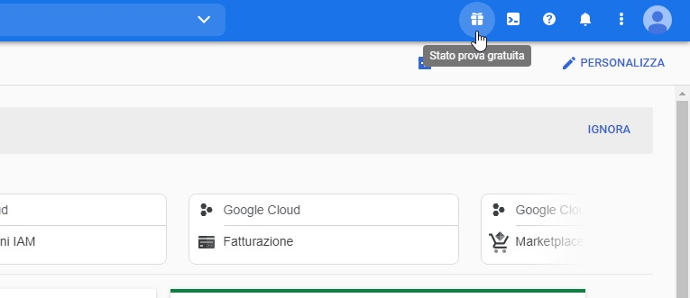
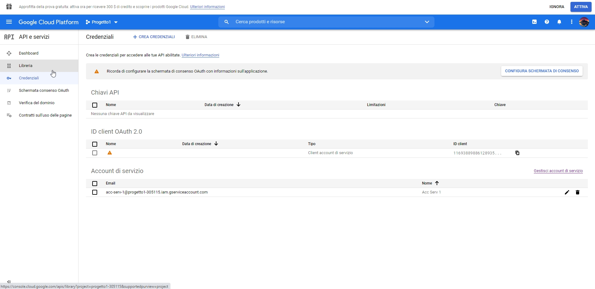
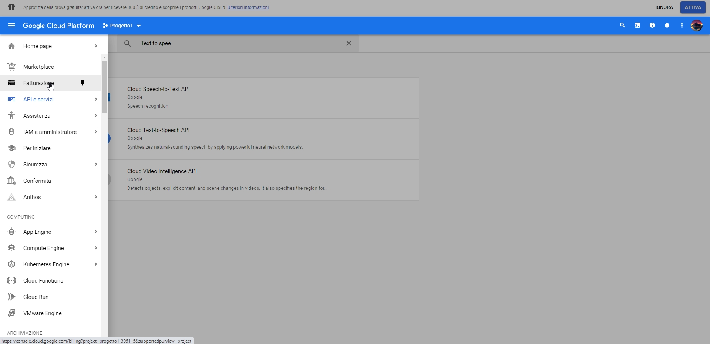

.. _WaveNet: https://cloud.google.com/text-to-speech/docs/wavenet
.. _Google cloud tts: https://cloud.google.com/text-to-speech/pricing
.. _Google cloud stt: https://cloud.google.com/speech-to-text/pricing
.. _creazione account di google: https://accounts.google.com/signup/v2/webcreateaccount?continue=https%3A%2F%2Fwww.google.it%2F&hl=it&dsh=S251938807%3A1613575646693186&gmb=exp&biz=false&flowName=GlifWebSignIn&flowEntry=SignUp
.. _Google Cloud Platform: https://console.cloud.google.com/projectselector2/home/dashboard?supportedpurview=project

==========================================
Configurazione Google Speech Service
==========================================

| Il **Google Speech Service** si divide in due servizi di riconoscimento e sintetizzazione vocale, ed entrambi richiedono diversi piani di fatturazione:

**TTS** ( Text-To-Speech ):

+------------------------------+--------------------------------+-----------------------------------------------+
|          Funzionalità        |         Gratuità mensile       |  Prezzo dopo aver raggiunto la quota gratuita |
+------------------------------+--------------------------------+-----------------------------------------------+
|  Voci standard (Non WaveNet) |  Da 0 a 4 milioni di caratteri |  $ 4,00 per milione di caratteri              |
+------------------------------+--------------------------------+-----------------------------------------------+
|  Voci WaveNet_                |  Da 0 a 1 milione di caratteri |  $ 16,00 per milione di caratteri             |
+------------------------------+--------------------------------+-----------------------------------------------+

**STT** ( Speech-To-Text ):

+------------------------------------+----------------------------------------------------------+----------------------------------------------------------+
|                   Funzionalità     |                       Modelli standard                   |                       Modelli avanzati                   |
+------------------------------------+---------------+------------------------------------------+---------------+------------------------------------------+
|                                    |  0-60 minuti  |  Oltre 60 minuti fino ad 1 mln di minuti |  0-60 minuti  |  Oltre 60 minuti fino ad 1 mln di minuti |
+------------------------------------+---------------+------------------------------------------+---------------+------------------------------------------+
|  Riconoscimento senza log dei dati |  Nessun costo |  $ 0,006 ogni 15 secondi                 |  Nessun costo |  $ 0,009 ogni 15 secondi                 |
+------------------------------------+---------------+------------------------------------------+---------------+------------------------------------------+
|  Riconoscimento con log dei dati   |  Nessun costo |  $ 0,004 ogni 15 secondi                 |  Nessun costo |  $ 0,006 ogni 15 secondi                 |
+------------------------------------+---------------+------------------------------------------+---------------+------------------------------------------+

Risorse: `Google cloud tts`_ e `Google cloud stt`_

Per iniziare è necessario possedere un normale account google, il quale è possibile crearlo nell'apposita pagina di `creazione account di google`_.
Una volta creato il proprio account, è possibile configurare il proprio account accedendo alla pagina di `Google Cloud Platform`_, eseguendo i seguenti step:
    - Accedere con il proprio account google se non si è ancora fatto l'accesso.
     |dashboard|
    - Selezionare **CREA PROGETTO** sulla pagina di dashboard.
    - Inserire un nome di progetto e premere **CREA**.
    - Una volta finita la creazione, selezionare **API e servizi** e poi **Credenziali** dal menu laterale.
     |ApiEServizi|
    - Premere **CREA CREDENZIALI**, selezionare **Account di servizio** ed immettere un nome a scelta e successivamente premere **CREA**.
    - Nella voce **Seleziona ruolo**, scorrere fino alla voce **Progetto**, a fianco selezionare **Proprietario**, premere **CONTINUA** e poi **FINE**.
     |roleSelect|
    - Una volta visualizzata la lista delle credenziali, selezionare l'account appena creato dalla sezione **Account di servizio** della pagina credenziali.
     |accountSelect|
    - Premere su **AGGIUNGI CHIAVE**, **Crea nuova chiave**, selezionare **JSON** e premere **CREA**.
    - Salva il file sul proprio pc in modo tale da poterlo utilizzare in un secondo momento.
    - Una volta salvato il file sul computer, selezionare la voce **Libreria** a sinistra della pagina
     |library|
    - Inserire nella barra di ricerca il testo "text-to-speech"
    - A questo punto saranno visualizzati dei risultati, tra cui **Cloud Speech-to-Text API** e **Cloud Text-to-Speech API**, aprire entrambi uno alla volta e abilitarli premendo il pulsante **ABILITA** nella rispettiva pagina.

A questo punto la configurazione è conclusa e la chiave appena scaricata sarà utilizzata dal TVox per sfruttare i servizi Google.

Per avere informazioni riguardanti la fatturazione del proprio progetto, si può selezionare la voce **Fatturazione** dal menù di Google Cloud Platform.
|fatturazione|

| Per aggiungere credito all'account è necessario attivare la prova gratuita, premendo sul pulsante **ATTIVA** sulla notifica di attivazione in testa alla pagina.
| La prova gratuita garantisce 300 $ di credito gratuito ma per iniziare bisogna inserire una carta di credito.
| Nel caso la notifica di attivazione non fosse presente, selezionare l'icona "regalo" in alto a destra nella pagina Google Cloud Platform.

|presentButton|