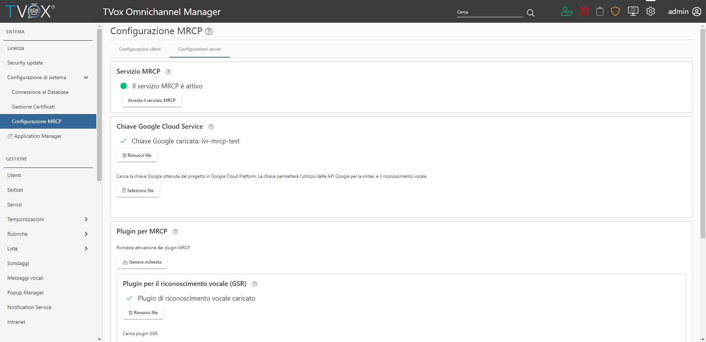
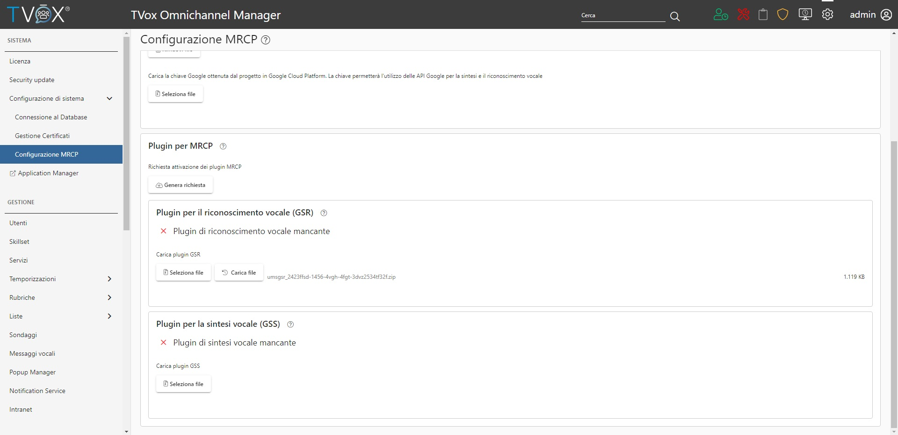
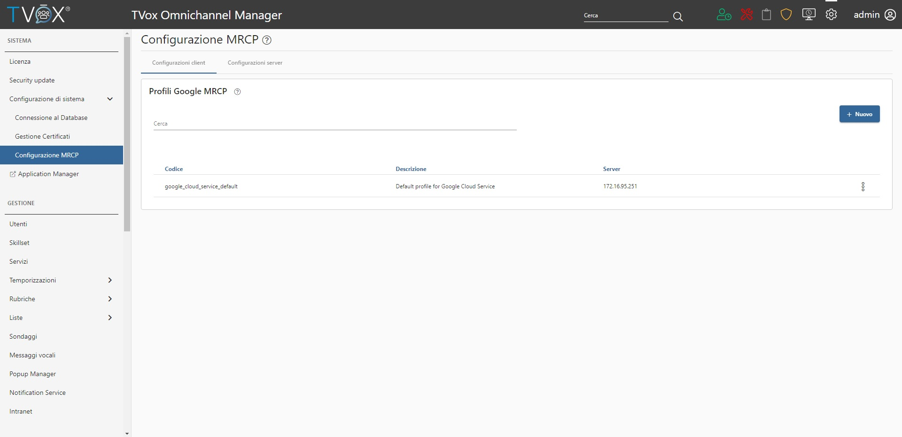

==========================================
Configurazione Occ
==========================================

Configurazione del server MRCP
==========================================

| Il server MRCP è necessario per effettuare richieste di sintesi e riconoscimento vocale verso Google, ed è possibile abilitarlo 
| nella sezione **Sistema** → **Configurazione MRCP** → **Configurazione server**.
| L'abilitazione del server richiede la presenza della chiave google ( file json ) e di almeno uno dei due plugin MRCP caricabili nella stessa pagina.

|abot_occ_abilitazione_server|

| La chiave json è ottenibile durante la configurazione di Google Speech Service sulla Google Cloud Platform, mentre i plugin MRCP 
| sono forniti da Telenia Software, dopo aver generato una richiesta di attivazione.
| Questa richiesta è effettuabile tramite il pulsante "Genera Richiesta" nella sezione **Plugin per MRCP**. 
| Subito dopo aver richiesto l'attivazione, verrà scaricato un file contenente le seguenti informazioni di sistema:

- Indirizzo IP
- Indirizzo MAC 
- Hostname

| Queste informazioni sono essenziali in quanto identificano la macchina su cui le licenze sono attivate, di conseguenza bisogna assicurarsi che 
| la macchina sia configurata correttamente prima di generare la richiesta.
| Una volta ottenuto il file, è necessario inviarlo a Telenia Software, la quale fornirà dei file ZIP contenenti i rispettivi plugin MRCP.
| A questo punto ogni zip deve essere caricato nella rispettiva sezione GSR o GSS per abilitare la funzionalità.

|abot_occ_caricamento_plugin|

**Note aggiuntive**: il server MRCP può risiedere su una macchina differente rispetto a quella che ospita il client MRCP. 

Configurazione dei profili MRCP
=========================================

All'interno dei profili si può configurare l'ip del server MRCP che si occupa della gestione delle richieste. In questa sezione è sempre presente un profilo non cancellabile, che è utilizzato come default se profili aggiuntivi non sono stati creati.

.. warning:: L'indirizzo del server del profilo corrisponde all'indirizzo IP fisico della macchina che sta ospitando il server MRCP. Se vengono specificati indirizzi IP virtuali le richieste non andranno a buon fine.

Dal momento che il server e il client MRCP possono risiedere in macchine separate, è possibile creare più di un profilo MRCP, e specificare un server diverso.

|abot_occ_pagina_profili|

Fault tolerance
==========================================

| In uno scenario in cui il TVox è ridondato, è possibile eseguire queste configurazioni sia su master che su slave, in modo da avere due server MRCP attivi allo stesso momento.
| Questo tipo di configurazione richiede la presenza di plugin MRCP diversi su entrambe le macchine, dato che i plugin sono forniti basandosi su indirizzo ip e mac della macchina.

| Nel caso si dispone di plugin MRCP per una sola macchina, è possibile configurare lo slave in modo tale che i profili del client puntino al server MRCP del master.
| Da un punto di vista configurativo, significa che entrambe le macchine devono disporre degli stessi profili MRCP identificati dallo stesso codice del profilo.
