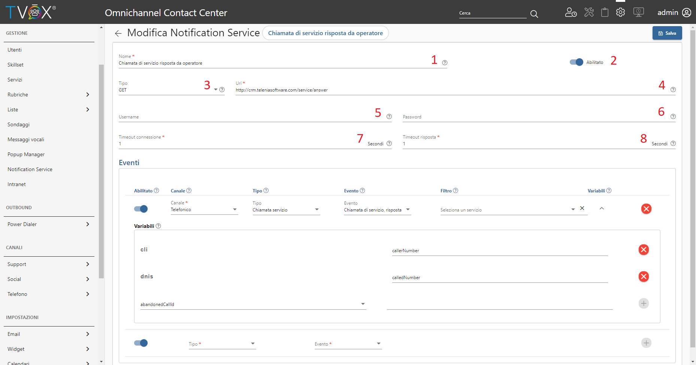

================================
Configura i servizi di notifica
================================

I servizi di notifica possono essere configurati da un'apposita sezione dell'OCC: **Notification Service**.

Come mostrato in figura, da questa interfaccia è possibile cercare (1) e gestire (2) i servizi configurati e crearne di nuovi (3).

Crea un nuovo servizio di notifica
==================================

In questa sezione puoi configurare gli eventi di chiamata che verranno notificati su un singolo Web Service.

.. warning:: Sul server dove risiede il Web Service, le richieste provenienti da TVox devono essere consentite e non bloccate da alcun controllo di accesso o firewall. In genere, le richieste **HTTP** si verificano sulla porta *8080*/*80*, mentre le richieste **HTTPS** si verificano sulla porta *443*.

Vediamo nel dettaglio quali sono i parametri di configurazione del Web Service in riferimento alla seguente immagine:

#. **Nome**, descrive brevemente il gruppo di eventi notificati al Web Service corrente
#. **Abilitato**, abilita/disabilita le notifiche al Web Service corrente
#. **Tipo**, metodo HTTP con cui verranno eseguite le richieste verso il Web Service, può essere di 2 tipi:

    #. `GET`, le variabili configurate sugli eventi vengono notificate attraverso parametri in `query string <https://it.wikipedia.org/wiki/Query_string>`_
    #. `POST`, le variabili configurate sugli eventi vengono notificate all'interno del body della richiesta (``Context-Type: application/x-www-form-urlencoded``)
#. **URI**, URI del Web Service su cui verranno eseguite le richieste
#. **Username** (*Opzionale*), username di autenticazione tramite |basic_authentication_link|
#. **Password** (*Opzionale*), password di autenticazione tramite |basic_authentication_link|
#. **Timeout connessione**, tempo massimo (in secondi) entro cui la richiesta tenterà una connessione verso l'URI configurato
#. **Timeout risposta**, tempo massimo (in secondi) che la richiesta aspetterà per avere una risposta dall'URI configurato

Ora approfondiamo la configurazione degli eventi:

#. **Abilitato**, abilita/disabilita le notifiche del singolo evento al Web Service corrente
#. **Tipo**, tipologia della chiamata da notificare
#. **Evento**, evento da notificare in base al tipo di chiamata selezionato
#. **Filtro** (*Opzionale*), se l'evento riguarda una chiamata di servizio, è possibile filtrare l'evento su un singolo servizio 
#. **Variabili**, mappa chiave/chiave delle informazioni dell'evento da notificare al Web Service

La descrizione dettagliata degli eventi e delle variabili configurabili può essere trovata nella documentazione tecnica.

Documentazione tecnica
======================

Per conoscere la versione di libreria "Notification Service" attualmente disponibile nel vostro sistema TVox, potete andare sull'OCC nella sezione info.
Conoscendo la vostra versione potete accedere alla |documentation_link|

.. image:: ../../images/info.png

Log
======================

.. .. image:: ../../images/notificationService/ConfigurazioneOCC_Log.png

Nella sezione *Log* è possibile visionare e scaricare il log mensile delle notifiche prodotte dal Notification Service. |br|
Questo può tornare molto utile sia in fase di sviluppo del Web Service, sia per un'analisi approfondita nel caso in cui vi fosse qualche malfunzionamento.

.. note:: Il log viene mantenuto per 12 mesi.

.. |br| raw:: html

    

.. |documentation_link| raw:: html

    <a href="http://documentation.teleniasoftware.com/notification_service/index.html#introduction"target="_blank"> Documentazione tecnica</a>

.. |basic_authentication_link| raw:: html

    <a href="https://it.wikipedia.org/wiki/Basic_access_authentication"target="_blank">Basic Authentication</a>