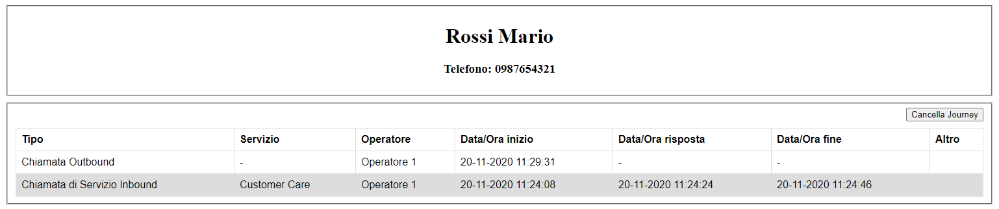
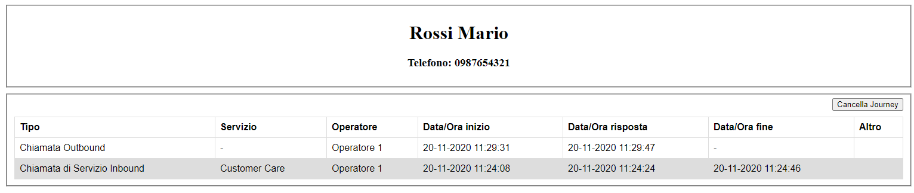
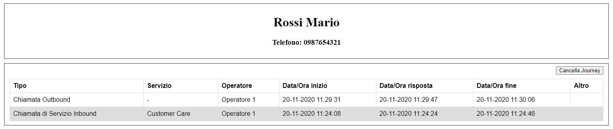

============================
Chiamata outbound
============================

Per prima cosa configuriamo i servizi di notifica per gestire i seguenti eventi:

.. toctree::
   :maxdepth: 1

   ChiamataOutbound/NuovaChiamata
   ChiamataOutbound/ChiamataRisposta
   ChiamataOutbound/ChiamataAbbattuta

--------------------------

Dopo aver loggato l'operatore *Operatore 1* e averlo reso pronto sul canale telefonico, chiamiamo il il contatto *Mario Rossi* (numero: *0987654321*).

Nel momento in cui la chiamata viene effettuata, riceveremo una notifica di ":ref:`ChiamataOutbound_Nuova`" e il nostro Web Service produrrà sulla scheda contatto del CRM un risultato di questo tipo:

--------------------------

Quando il contatto risponderà alla chiamata, riceveremo una notifica di ":ref:`ChiamataOutbound_Risposta`" e aggiornando la scheda contatto vedremmo popolarsi la data/ora di risposta:

--------------------------

Infine, quando la chiamata verrà abbattuta, riceveremo una notifica di ":ref:`ChiamataOutbound_Abbattuta`" e aggiornando la scheda contatto vedremmo popolarsi anche la data/ora di termine della chiamata:

