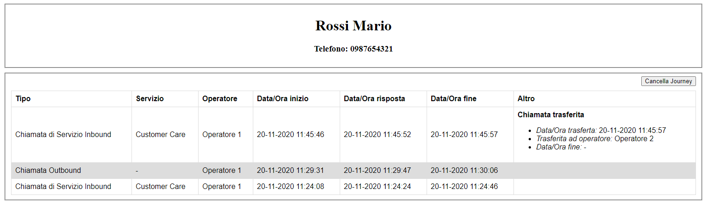

============================
Chiamata trasferita
============================

Per quanto riguarda la gestione degli eventi di chiamata trasferita, è importante distinguere 2 tipologie di trasferta che possono essere effettuate con il TVox:

- **Trasferta diretta** (*blind*), l'operatore in chiamata, la trasferisce *direttamente* ad un altro operatore senza prima consultarlo
- **Trasferta con consultazione**, l'operatore in chiamata, la mette in attesa per *consultare* prima l'operatore a cui vuole trasferirla; successivamente unisce la chiamata originale con quella verso l'operatore consultato

Per la loro diversa natura, anche la gestione degli eventi correlati è differenziata; vediamo nel dettaglio la loro configurazione:

.. toctree::
   :maxdepth: 1

   ChiamataTrasferita/ChiamataTrasferita
   ChiamataTrasferita/ChiamataRisposta
   ChiamataTrasferita/ChiamataAbbattuta

--------------------------

Trasferta diretta (blind)
=========================

Dopo aver loggato l'operatore *Operatore 1* e averlo reso pronto sul canale telefonico, loggato l'operatore *Operatore 2* non pronto sul canale telefonico (per evitare che la chiamata arrivi a lui, ai fini dell'esempio), chiamiamo il numero di servizio del *Customer Care* dal contatto *Mario Rossi* (numero: *0987654321*).

Rispondiamo alla chiamata con *Operatore 1* e trasferiamola direttamente a *Operatore 2*. In questo momento riceveremo una notifica di ":ref:`ChiamataTrasferita_Trasferita`" e il nostro Web Service produrrà sulla scheda contatto del CRM un risultato di questo tipo:

Quando *Operatore 2* risponderà alla chiamata, riceveremo una notifica di ":ref:`ChiamataTrasferita_Risposta`", che utilizziamo per individuare la tipologia di trasferta. Confrontando i due precedenti eventi, possiamo infatti notare che riportano lo stesso *callId* della chiamata originale ricevuta da *Operatore 1*; in questo modo possiamo tracciare e distinguere l'evento di trasferta da quello di effettiva risposta da parte di *Operatore 2*.

Infine, quando la chiamata verrà abbattuta, riceveremo una notifica di ":ref:`ChiamataTrasferita_Abbattuta`" e aggiornando la scheda contatto vedremmo popolarsi anche la data/ora di termine della chiamata trasferita; inoltre vediamo che, con le informazioni acquisite dagli eventi precedenti, possiamo definire la trasferta come "*diretta / blind*":

Trasferta con consultazione
===========================

Dopo aver loggato l'operatore *Operatore 1* e averlo reso pronto sul canale telefonico, loggato l'operatore *Operatore 2* non pronto sul canale telefonico (per evitare che la chiamata arrivi a lui, ai fini dell'esempio), chiamiamo il numero di servizio del *Customer Care* dal contatto *Mario Rossi* (numero: *0987654321*).

Rispondiamo alla chiamata con *Operatore 1*, chiamiamo *Operatore 2* mettendo in attesa la chiamata ricevuta. 
Unendo le due chiamate riceveremo una serie di notifiche di ":ref:`ChiamataTrasferita_Trasferita`", di cui consideriamo solo l'unica associata al *callId* della chiamata originale; in questo modo possiamo tracciare l'evento di trasferta che corrisponde con quello di risposta da parte di *Operatore 2*, trattandosi dell'unione delle due chiamate.

Il nostro Web Service produrrà sulla scheda contatto del CRM un risultato che già definisce la trasferta "*con consultazione*":

.. image:: ../../../images/notificationService/ChiamataTrasferita_consultazione_transfer.png

Infine, quando la chiamata verrà abbattuta, riceveremo una notifica di ":ref:`ChiamataServizioInbound_Abbattuta`" e aggiornando la scheda contatto vedremmo popolarsi anche la data/ora di termine della chiamata trasferita; inoltre vediamo che, con le informazioni acquisite dagli eventi precedenti, possiamo definire la trasferta "*con consultazione*":

