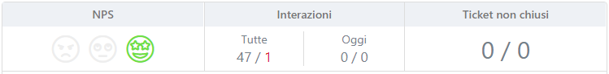
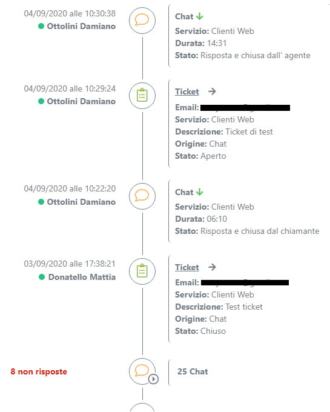
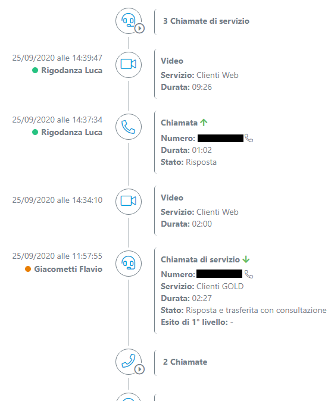

=================
Customer Journey
=================

Il customer journey fornisce una panoramica delle interazioni che un cliente ha avuto con il contact center, migliorando la customer experience e la produttività degli agenti.

---------

La prestazione è legata ai moduli di licenza abilitati su |tvox|.
Il modulo principale è **Customer Journey**, che abilita la cronologia di interazioni multichannel, riportando di base soltanto le chiamate telefoniche.
Per abilitare la visualizzazione di altri tipi di interazione sono necessari i seguenti moduli:

- **Support** (Per le interazioni di tipo Ticket)
- **Sondaggi** (Per abilitare l\'NPS)
- **Web Widget** (Per le interazioni di tipo Chat)
- **Whatsapp** (Per le interazioni dal canale whatsapp)

Il modulo **Customer Journey** abilita i processi lato server a collezionanare le informazioni relative ai diversi tipi di interazione ed abilita |client| alla visualizzazione delle informazioni.

.. important:: Per attivare il Customer Journey è necessario predisporre un server dedicato (Fisico o Virtuale)

---------

Grazie al Customer Journey, su |client| vengono messe a disposizione principalmente due informazioni riguardanti il cliente:

- NPS (Net promoter score)
- Storico di **tutte** le interazioni che il cliente ha avuto con il contact center

NPS è una valutazione fornita dal cliente attraverso un sondaggio, e rappresenta il suo grado di soddisfazione relativo all'ultima interazione che ha avuto con il servizio. Questa valutazione costituisce un aiuto per gli agenti nel momento in cui il cliente ingaggia nuovamente il sistema.

Come evidenziato nell'immagine seguente, nella sezione di |client| dedicata al customer journey troviamo:
- la valutazione NPS
- il numero di interazioni generate da o verso questo cliente negli ultimi 30 giorni
- il numero totale di ticket che sono attualmente attivi sul cliente visualizzato e, tra questi, il numero di quelli in escalation

.. raw:: html

    

|customer_journey_header|

.. raw:: html

    

Sotto a tali informazioni, è riportata una linea temporale che dettaglia tutte le interazioni che il cliente ha avuto con il contact center su tutti i canali tramite i quali ha interagito.

Su ogni interazione è indicato, con apposita icona, il canale su cui è avvenuta, e vengono proposti i dettagli in base al canale stesso.

.. raw:: html

    

|customer_journey_body_1|

|customer_journey_body_2|

.. raw:: html

    

Le interazioni visualizzate all'interno del customer journey dipendono dalle competenze dell'agente: vengono proposte solo quelle relative ai servizi e canali abilitati sul profilo di lavoro attivo.

Sono disponibili nel seguente elenco dei video-corsi che illustrano e spiegano il funzionamento del Customer Journey

 .. toctree::
   :maxdepth: 1

   CustomerJourneyVideoCorso/Intro
   CustomerJourneyVideoCorso/WebClient
   CustomerJourneyVideoCorso/NPS
   CustomerJourneyVideoCorso/Cronologia
   CustomerJourneyVideoCorso/Requisiti