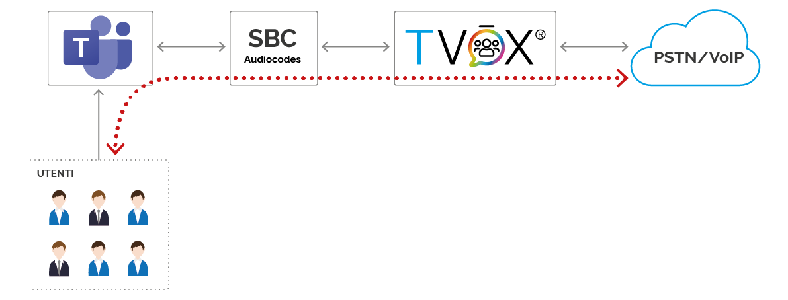
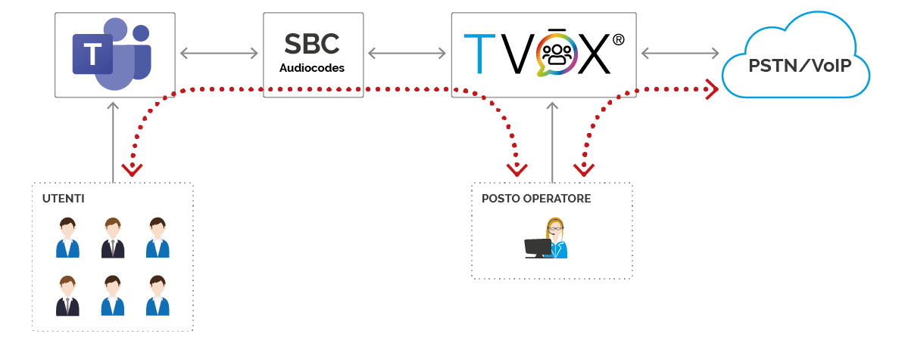
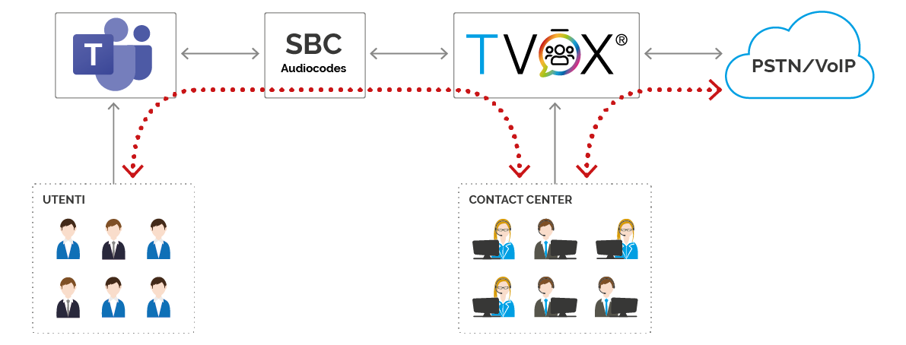
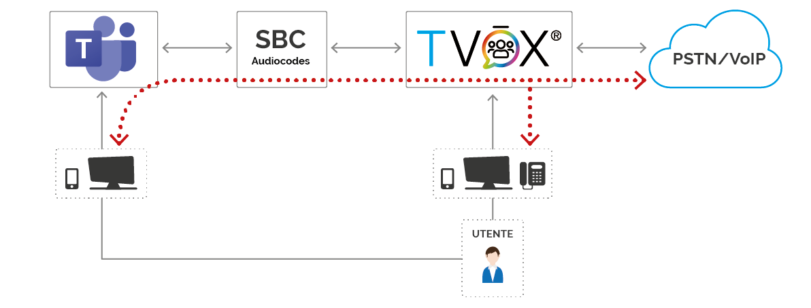

Funzioni dell'integrazione
===========================

PSTN Gateway
------------

La funzione base di questa integrazione prevede che |tvox_pbx| agisca come gateway per la gestione delle linee telefoniche aziendali e ne permette l'utilizzo con |msteams| senza sostituire l'infrastruttura.

Le linee possono essere:

- linee PSTN geografiche
- IPPBX esistenti 

Interconnettendo |msteams| alla rete pubblica tramite |tvox_pbx|, è possibile gestire chiamate telefoniche con alcuni trattamenti evoluti offerti da TVox stesso, quali ad esempio la consultazione di un calendario o l'attraversamento di un albero IVR.

Funzionalità telefoniche erogate su |msteams|:

- Effettuare e ricevere chiamate utilizzando |msteams| tramite client mobili e desktop
- Chiamare utenti del gruppo di lavoro e numeri PSTN utilizzando il tastierino di |msteams|
- Ricevere chiamate da PSTN
- Composizioni rapide, i contatti e la cronologia chiamate di |msteams|
- Trasferimento di chiamate di PSTN verso utenze Teams. Al trasferimento della chiamata viene mostrato all'utente a cui si trasferisce il numero e il nome dell'interlocutore su PSTN.
- Trasferimento di chiamata PSTN verso altro numero PSTN. 

Attendant Console
-----------------

Oltre alla funzione di gateway telefonico appena descritta, |tvox_pbx| può attivare il suo modulo di Attendant Console (Posto Operatore) che consente, con il proprio client, di gestire chiamate provenienti dalla rete pubblica e smistarle verso |msteams|.

Funzionalità telefoniche erogate su |msteams|:

- si ereditano tutte le feature del punto precedente
- le chiamate trasferite da Attendant Console verso un utente Teams presentano il numero e il nome dell'altro interlocutore.
  

Contact Center 
--------------

Attivando il modulo di Contact Center Multicanale si può realizzare un'isola di agenti su |tvox|.
Questi possono gestire sessioni telefoniche e multicanale e interagire telefonicamente con gli utenti attestati su |msteams|.

Funzionalità telefoniche erogate su |msteams|:

- si ereditano tutte le feature del punto precedente

Twin TVox & Microsoft Teams®
-----------------------------

L'integrazione tra |msteams| e |tvox_pbx| permette di gestire chiamate dalla PSTN o interne da altri utenti |tvox_pbx| facendo squillare contemporaneamente sia il client |msteams| che il  dispositivo attestato su |tvox_pbx|

Per un utente che necessita di utilizzare sia |msteams| che un dispositivo attestato su |tvox_pbx|, l'integrazione permette di 
gestire le chiamate dirette a lui facendo squillare contemporaneamente sia il client |msteams| sia il  dispositivo utilizzato su |tvox_pbx|. |br| 
Ad esempio, configurandolo in questa modalità, l'utente può usare il client |msteams| finchè si trova alla propria scrivania, e il proprio dispositivo cordless in aree dell'azienda dove |msteams| non è utilizzabile.
In questa modalità una chiamata risposta da dispositivo attestato su |tvox_pbx| determina su |msteams| una chiamata persa, avendo effettivamente suonato il client; non è vero il viceversa, una chiamata risposta da |msteams| non determina una chiamata persa su |tvox_pbx|.

.. |msteams| raw:: html 

    <a href="https://teams.microsoft.com/"target="_blank"> Microsoft Teams®</a>

