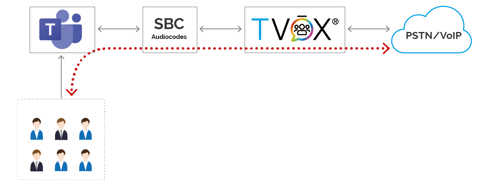
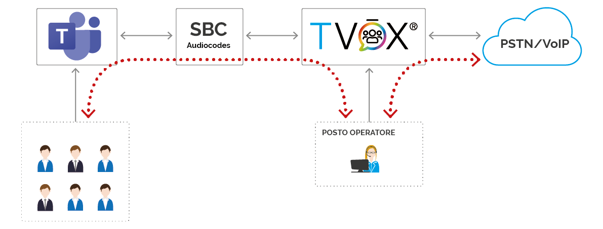
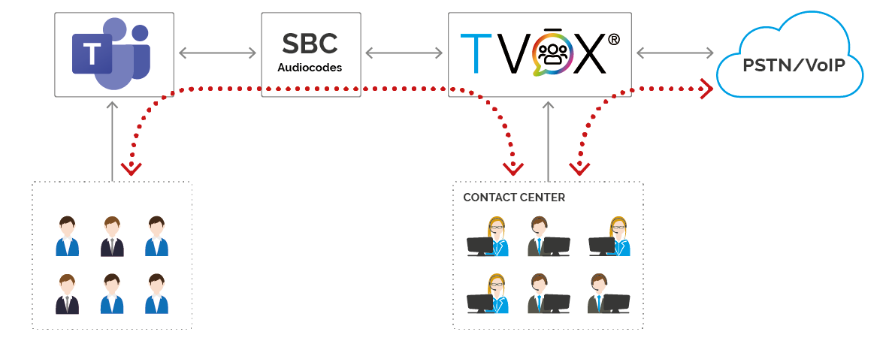
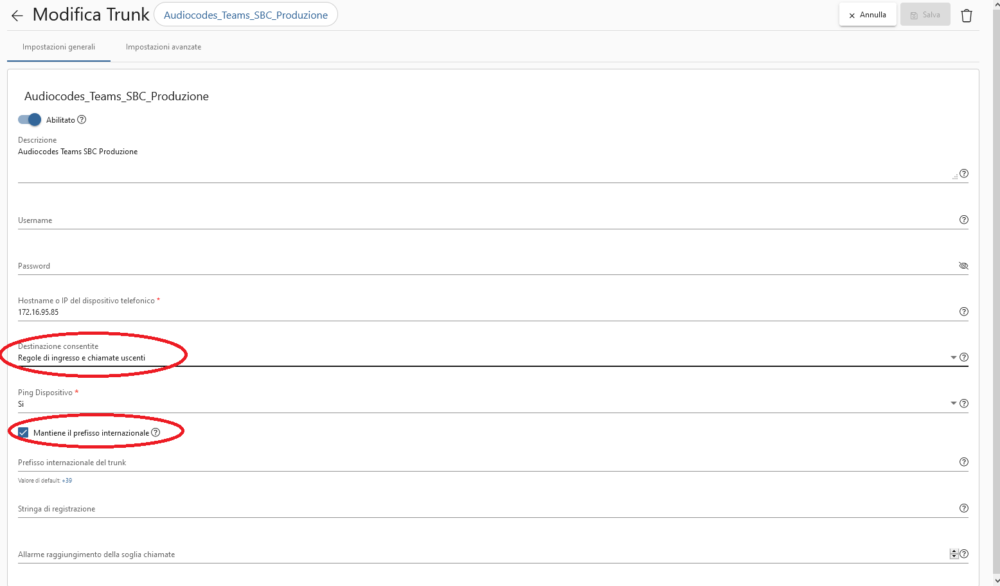

================
Microsoft Teams
================

La |tvox_platform| può essere interconnessa a |msteams| per estenderne le funzionalità telefoniche.

La modalità di interconnessione della |tvox_platform| prevede l'utilizzo di un sistema SBC (Session Border Controller) che interconnette |msteams| con |tvox_pbx|. 
I possibili SBC supportati da Microsoft sono elencati al seguente `link <https://docs.microsoft.com/en-us/microsoftteams/direct-routing-border-controllers>`_, 
Telenia consiglia l'utilizzo di dispositivi Audiocodes. 

Funzioni dell'integrazione
===========================

PSTN Gateway
------------

La funzione base di questa integrazione prevede che |tvox_pbx| agisca come gateway per la gestione delle linee telefoniche aziendali e ne permette l'utilizzo con |msteams| senza sostituire l'infrastruttura.

Le linee possono essere:

- linee PSTN geografiche
- IPPBX esistenti 

Interconnettendo |msteams| alla rete pubblica tramite |tvox_pbx|, è possibile gestire chiamate telefoniche con alcuni trattamenti evoluti offerti da TVox stesso, quali ad esempio la consultazione di un calendario o l'attraversamento di un albero IVR.

Attendant Console
-----------------

Oltre alla funzione di gateway telefonico appena descritta, |tvox_pbx| può attivare il suo modulo di Attendant Console (Posto Operatore) che consente, con il proprio client, di gestire chiamate provenienti dalla rete pubblica e smistarle verso |msteams|.

Contact Center 
--------------

Attivando il modulo di Contact Center Multicanale si può realizzare un'isola di agenti su |tvox|.
Questi possono gestire sessioni telefoniche e multicanale e interagire telefonicamente con gli utenti attestati su |msteams|.

Twin TVox & Microsoft Teams®
-----------------------------

.. image:: ../../images/microsoft/teams/teams_arch_04.png

L'integrazione tra |msteams| e |tvox_pbx| permette di gestire chiamate dalla PSTN facendo squillare contemporaneamente sia il client |msteams| che il  dispositivo attestato su |tvox_pbx|

Per un utente che necessita di utilizzare sia |msteams| che un dispositivo attestato su |tvox_pbx|, l'integrazione permette di 
gestire le chiamate dirette a lui facendo squillare contemporaneamente sia il client |msteams| sia il  dispositivo utilizzato su |tvox_pbx|. |br| 
Ad esempio, configurandolo in questa modalità, l'utente può usare il client |msteams| finchè si trova alla propria scrivania, e il proprio dispositivo cordless in aree dell'azienda dove |msteams| non è utilizzabile.

Attivazione
===========

Prerequisiti
------------

Su |msteams| :

- attivare le licenze utente 'Microsoft 365 Business Standard'
- attivare le licenze utente 'Voip Aziendale di Microsoft 365'

Acquistare e attivare un SBC certificato Microsoft, Telenia consiglia un dispositivo Audiocodes.

.. important:: Deve essere garantita la raggiungibilità tra |tvox_pbx| e l'SBC.

Il collegamento tra SBC e |tvox_pbx| avviene tramite trunk SIP. Il dispositivo SBC dovrà essere raggiungibile dalla piattaforma Teams tramite dominio pubblico.

.. important:: Microsoft indica come prerequisito il fatto che il dominio dell'SBC possegga un certificato SSL valido da caricare sull'SBC stesso. |br| ( `documentazione Microsoft <https://docs.microsoft.com/en-us/microsoftteams/direct-routing-landing-page>`_  )

Su |tvox_pbx|:

- scegliere un piano di numerazione per gli utenti attestati su |msteams| che devono essere raggiungibili telefonicamente da |tvox_pbx|. 

Questa numerazione sarà attivata come numerazione remota su |tvox_pbx|, permettendo a TVox stesso di vedere il sistema Teams come settore interno e non esterno. 

.. note:: Si consiglia sempre di utilizzare una numerazione di almeno 4 cifre che non collidi con la numerazione eventualmente già presente su |tvox_pbx|.

Configurazione
--------------

Il dispositivo SBC deve essere configurato per redirigere tutte le chiamate provenienti da |msteams| verso |tvox_pbx| e viceversa ( da |tvox_pbx| verso |msteams|). 

Su |msteams| accedendo alla interfaccia amministrativa : 

- attivare il `Direct Routing <https://docs.microsoft.com/en-us/microsoftteams/direct-routing-landing-page>`_ configurando l'SBC al link https://admin.teams.microsoft.com/direct-routing/v2
- attivare la numerazione definita sull'utente Teams previa attivazione delle licenze necessarie. L'attivazione della numerazione va effettuata via Power Shell di Windows dando i seguenti comandi 

Creazione del direct routing entry *TeamsVoice* dopo aver creato il trunk con dominio, a titolo di esempio, *audiocodes.teleniasoftware.com*

.. code-block:: sh

    $credential = Get-Credential
    Connect-MicrosoftTeams -Credential $credential
    Set-CsOnlinePstnUsage -Identity Global -Usage @{Add="TeamsVoice"}
    New-CsOnlineVoiceRoute -Identity "Default Route" -NumberPattern ".*" -OnlinePstnGatewayList "audiocodes.teleniasoftware.com" -Priority 1 -OnlinePstnUsages "TeamsVoice" 
    New-CsOnlineVoiceRoutingPolicy "VP-TeamsUser" -OnlinePstnUsages "TeamsVoice" 
    
Associazione del numero *8000* all'utente *mrossi@teleniasoftware.com*

.. code-block:: sh

    $credential = Get-Credential
    Connect-MicrosoftTeams -Credential $credential
    $session = New-CsOnlineSession -Credential $credential
    Import-PsSession $session
    Grant-CsOnlineVoiceRoutingPolicy -Identity mrossi@teleniasoftware.com -PolicyName "VP-TeamsUser" 
    Set-CsUser -Identity mrossi@teleniasoftware.com -EnterpriseVoiceEnabled $true -OnPremLineURI tel:8000 -HostedVoiceMail $true    

Su |tvox_pbx| 

#. configurare il trunk verso l'SBC facendo attenzione a configurare il parametro 'Destinazione consentite' con il valore 'Regole di ingresso e chiamate uscenti' e che sia attivo il mantenimento del prefisso internazionale

#. configurare una regola di uscita che componga la numerazione remota scelta e la stessa numerazione anteponendo il *+* 
#. configurare tutte le abilitazioni del sistema affinchè usino la regola appena creata. 

Se si vuole abilitare ad un utente di |tvox_pbx| il dispositivo |msteams|, è necessario agire tramite OCC nella sezione *Dispositivi* del dettaglio utente. 
Per renderlo attivo, inserire il numero scelto su |msteams| antemponendo il *+*. 
Nel nostro esempio, per l'utente *mrossi*, inseriamo il numero *+8000*.

.. image:: ../../images/microsoft/teams/teams_conf_dispositivo.png

.. |msteams| raw:: html 

    <a href="https://teams.microsoft.com/"target="_blank"> Microsoft Teams®</a>