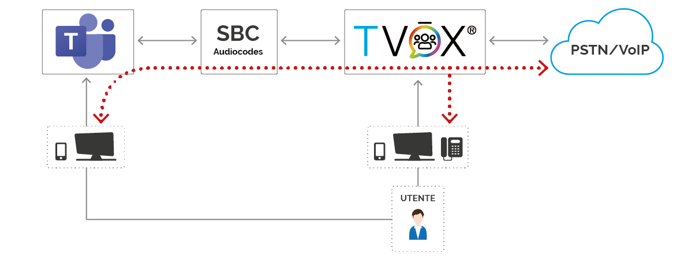
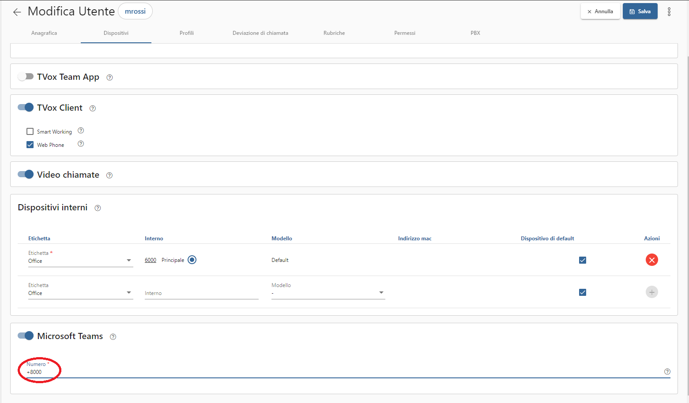

================
Microsoft Teams
================

|tvox_platform| può essere interconnessa a |msteams| per estenderne le funzionalità telefoniche.

La modalità di interconnessione della |tvox_platform| prevede l'utilizzo di un sistema SBC ( Session Border Control ) che interconnette |msteams| con |tvox_pbx|. 
I possibili SBC supportati da Microsoft sono elencati  al seguente `link <https://docs.microsoft.com/en-us/microsoftteams/direct-routing-border-controllers>`_ 
e i nostri tecnici consigliano l'uso di dispositivi Audiocodes. 

Funzioni della integrazione
===========================

PSTN Gateway
------------

.. image:: ../../images/microsoft/teams/teams_arch_01.png

La funzione base di questa integrazione prevede |tvox_pbx| come gateway per le risorse installate in azienda e ne permette l'utilizzo con |msteams| senza sostituire l'infrastruttura.

Queste risorse possono essere:

- linee PSTN geografiche
- IPPBX esistenti 

Interconnettendo |msteams| alla rete pubblica si permette di erogare servizi avanzati di contact center come l'accodamento evoluto fornito da |tvox_pbx|.

Feature telefoniche permesse su Teams:

- Effettuare e ricevere chiamate utilizzando |msteams| tramite client mobili e desktop
- Chiamare utenti del team e numeri PSTN utilizzando il tastierino di |msteams|
- Ricevere chiamate da PSTN
- Composizioni rapide, i contatti e la cronologia chiamate di |msteams|
- Trasferimento di chiamate di PSTN verso utenze Teams. Al trasferimento della chiamata avviene l'aggiornamento del numero e il nome dell'altro interlocutore.
- Trasferimento di chiamata PSTN verso altro numero PSTN. 

Attendant Console
-----------------

.. image:: ../../images/microsoft/teams/teams_arch_02.png

Assieme alla funzione di gateway, |tvox_pbx|, può attivare il suo modulo di Attendant Console (Posto Operatore) che con il proprio client può gestire chiamate provenienti dalla rete pubblica e smistarle verso |msteams|.

Feature telefoniche permesse su Teams:

- si eriditano tutte le feature del punto precendete
- le chiamate trasferite da Attendant Console verso un utente Teams presentano il numero e il nome dell'altro interlocutore.
  

Contact Center 
--------------

.. image:: ../../images/microsoft/teams/teams_arch_03.png

Attivando il modulo di Contact Center Multicanale si può realizzare un'isola di agenti su |tvox|.
Questi possono gestire sessioni telefoniche e multicanale e interagire telefonicamente con gli utenti attestati su |msteams|.

Feature telefoniche permesse su Teams:

- si eriditano tutte le feature del punto precendete

Twin TVox & Microsoft Teams®
-----------------------------

L'integrazione tra |msteams| e |tvox_pbx| permette di gestire chiamate dalla PSTN facendo squillare contemporaneamente sia il client |msteams| che il  dispositivo attestato su |tvox_pbx|

Per un utente che necessita di utilizzare |msteams| e |tvox_pbx| l'integrazione permette di .
gestire chiamate dalla PSTN sull'utente facendo squillare contemporaneamente sia il client |msteams| che il  dispositivo attestato su |tvox_pbx|.
Per esempio: configurando l'utente in questa modalità, può usare il client |msteams| e poter continuare ad utlizzare 
il proprio dispositivo cordless in aree dell'azienda dove |msteams| non è utilizzabile.

Attivazione
===========

Prerequisiti
------------

Su |msteams| :

- attivare le licenze utente 'Microsoft 365 Business Standard'
- attivare le licenze utente 'Voip Aziendale di Microsoft 365'

Acquistare e attivare SBC certificato Microsoft, Telenia consiglia un dispositivo Audiocodes.

.. important:: Deve essere garantita la raggiungibilità tra la piattaforma |tvox_pbx| e l'SBC.

Il collegamento tra SBC e |tvox_pbx| avviene tramite trunk SIP. Il dispositivo SBC dovrà essere raggiungibile dalla piattaforma Teams tramite dominio pubblico.

.. important:: Microsoft indica come prerequisito possedere per il dominio dell'SBC un certificato SSL valido da caricare sull'SBC stesso. |br| ( `documentazione Microsoft <https://docs.microsoft.com/en-us/microsoftteams/direct-routing-landing-page>`_  )

Su |tvox_pbx|:

- scegliere un piano di numerazione per gli utenti attestati su |msteams| che si vuole raggiungibili da |tvox_pbx|. 

Questa numerazione sarà attivata come numerazione remota su |tvox_pbx| permettendo alla |tvox_platform| di vedere il sistema Teams come settore interno e non esterno. 

.. note:: Si consiglia sempre una numerazione di almeno 4 cifre e che non collidi con la numerazione eventualmente già presente su |tvox_pbx|.

Configurazione
--------------

Il dispositivo SBC deve essere configurato per redirigere tutte le chiamate provenienti da |msteams| verso |tvox_pbx| e viceversa ( da |tvox_pbx| verso |msteams|). 

Su |msteams| accedendo alla interfaccia amministrativa : 

- attivare il `Direct Routing <https://docs.microsoft.com/en-us/microsoftteams/direct-routing-landing-page>`_ configurando l'SBC al link https://admin.teams.microsoft.com/direct-routing/v2
- attivare la numerazione definita sull'utente Teams previa attivazione delle licenze necessarie. L'attivazione della numerazione va effettuata via Power Shell di Windows dando i seguenti comandi 

creazione del direct routing entry *TeamsVoice* dopo aver creato il trunk con dominio *audiocodes.teleniasoftware.com*

.. code-block:: sh

    $credential = Get-Credential
    Connect-MicrosoftTeams -Credential $credential
    Set-CsOnlinePstnUsage -Identity Global -Usage @{Add="TeamsVoice"}
    New-CsOnlineVoiceRoute -Identity "Default Route" -NumberPattern ".*" -OnlinePstnGatewayList "audiocodes.teleniasoftware.com" -Priority 1 -OnlinePstnUsages "TeamsVoice" 
    New-CsOnlineVoiceRoutingPolicy "VP-TeamsUser" -OnlinePstnUsages "TeamsVoice" 
    
associazione del numero *8000* all'utente *test@teleniasoftware.com*

.. code-block:: sh

    $credential = Get-Credential
    Connect-MicrosoftTeams -Credential $credential
    $session = New-CsOnlineSession -Credential $credential
    Import-PsSession $session
    Grant-CsOnlineVoiceRoutingPolicy -Identity test@teleniasoftware.com -PolicyName "VP-TeamsUser" 
    Set-CsUser -Identity test@teleniasoftware.com -EnterpriseVoiceEnabled $true -OnPremLineURI tel:8000 -HostedVoiceMail $true    

Su |tvox_pbx| 

#. configurare il trunk verso l'SBC facendo attenzione a settare le 'Destinazione consentite' su 'Regole di ingresso e chiamate uscenti' e che sia attivo il mantenimento del prefisso internazionale

.. image:: ../../images/microsoft/teams/teams_conf_trunk.png

#. configurare regola di uscita perchè componga la numerazione remota scelta e la stessa numerazione anteponendo il *+* 
#. configurare tutte le abilitazioni del sistema perchè usino questa numerazione remota. 

Se si vuole abilitare ad un utente di |tvox_pbx| il dispositivo |msteams|, lo si può fare dall'OCC nella sezione *Dispositivi* del dettaglio utente. 
Per renderlo attivo, inserire il numero scelto su |msteams| antemponendo il *+*. 
Nel nostro esempio, per l'utente *test*, inseriamo il numero *+8000*.

.. |msteams| raw:: html 

    <a href="https://teams.microsoft.com/"target="_blank"> Microsoft Teams®</a>