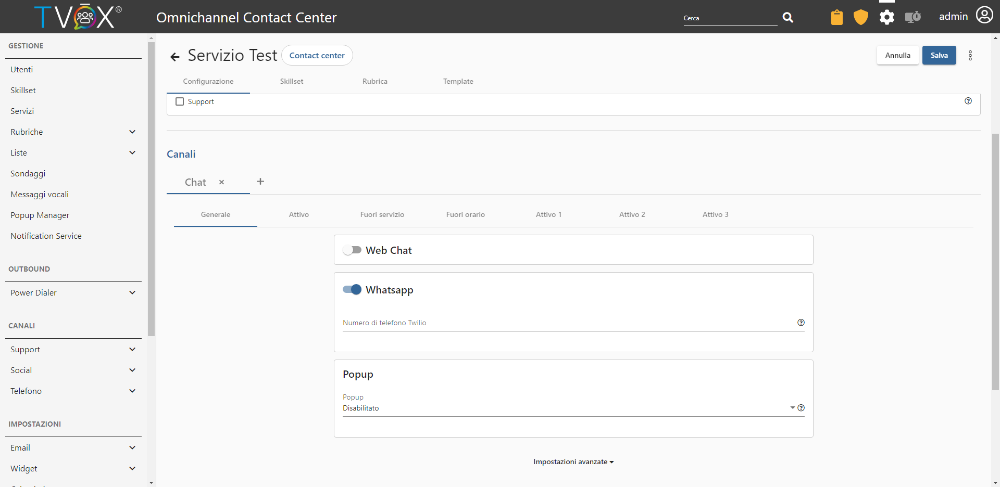
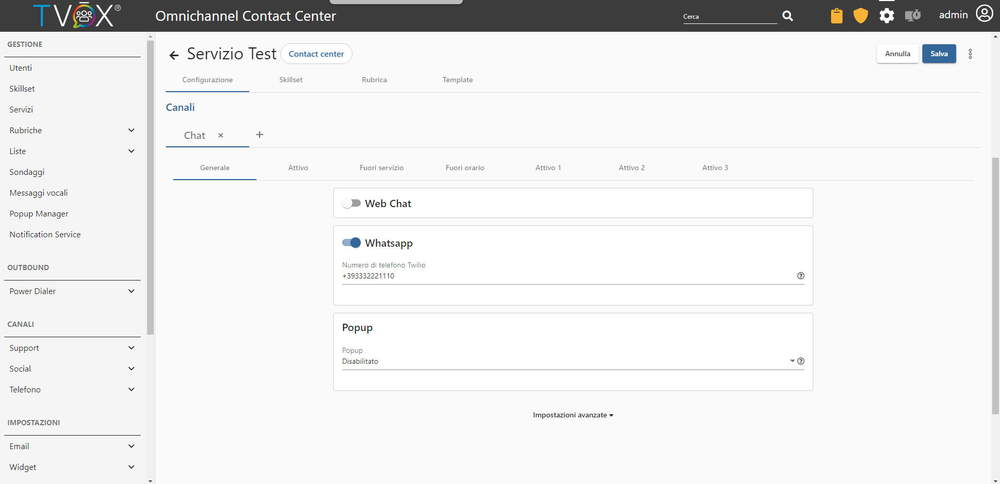
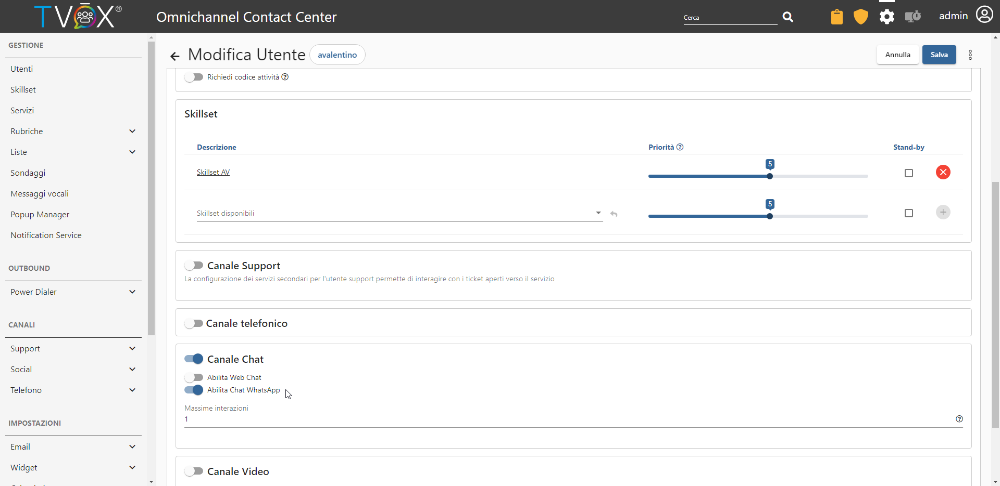
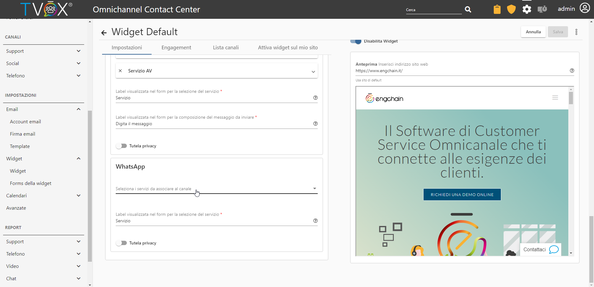
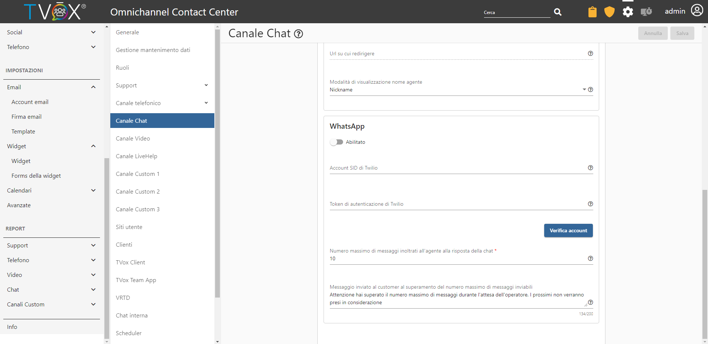

====================================
Configurazione OCC
====================================

L'accesso al canale WhatsApp può esseere reso disponibile su sito web attraverso la widget, dove viene presentato un QRcode che deve essere scansionato con uno smartphone per essere rediretti al contatto WhatsApp dell'azienda.
In alternativa, può essere pubblicato, sempre su widget, un link che ridirezioni direttamente alla versione web di WhatsApp stesso.

    L'ingaggio del canale WhatsApp da parte del customer, avviene principalmente attraverso la widget 
    tramite l'utilizzo di un QRcode che l'utente può scannerizzare con lo smartphone, o un link che porta all'interfaccia di WhatsApp web se ingaggiato dal PC.

Se, invece, l'utente ha già memorizzato in rubrica il numero telefonico dell'account Whatsapp dell'azienda, o se viene predisposto un link che reindirizza al numero WhatsApp, il canale può essere ingaggiato direttamete, senza necessariamente passare attraverso la widget.

Per esporre il QRcode sulla propria widget, è necessario seguire i seguenti step:

- Creare un nuovo servizio o selezionare uno già esistente
- Aggiungere il canale chat al servizio, e abilitare la voce WhatsApp

|AbilitazioneSuServizio|

- Inserire nel nuovo campo il numero aquistato e configurato sulla piattaforma Twilio

|AggiuntaNumeroSuServizio|

- Nella sezione utenti, selezionare il profilo di un agente e abilitare la voce relativa a WhatsApp dopo aver abilitato il canale Chat.

|AbilitazioneSuProfilo|

Una volta configurati gli utenti e i servizi, assegnare il servizio alla widget in Impostazioni→Widget→Widget in uso→Canali→WhatsApp

|AssegnazioneServizioWidget|

- Nella sezione OCC Impostazioni→Avanzate→Canale Chat, abilitare la voce WhatsApp ed inserire nei due campi sottostanti i corrispettivi SID e token di autenticazione forniti da Twilio. Per verificare la correttezza del SID e del Token, è possibile eseguire un test di autenticazione premendo sul pulsante "Verifica Account"

|ImpostazioniAvanzate|
