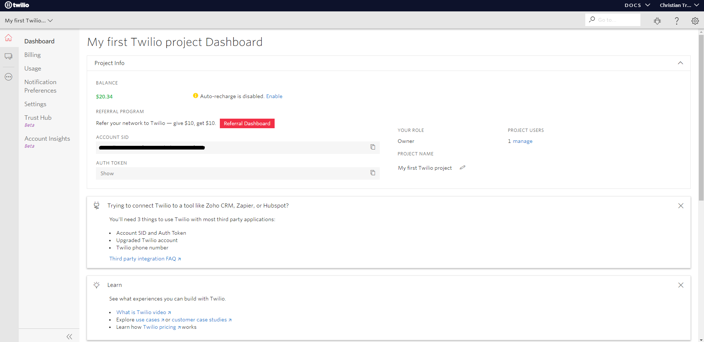
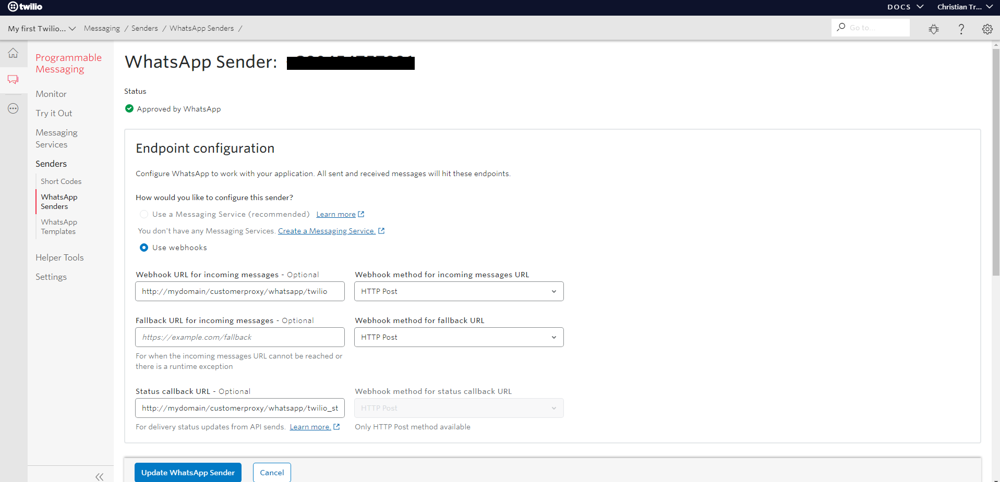
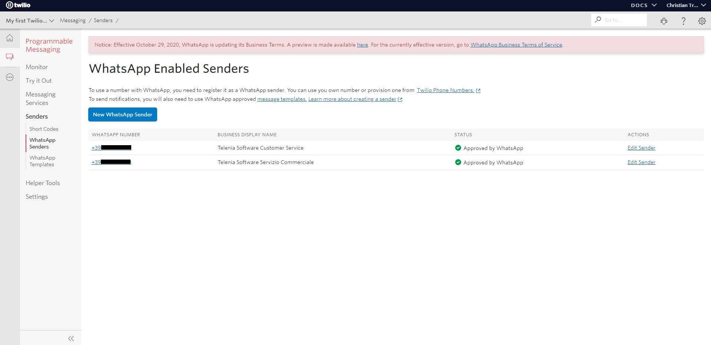

.. _twilio: https://www.twilio.com/
.. _form: https://docs.google.com/forms/d/e/1FAIpQLSeVY4XfAFpR4ZdGMflESFnjSu3fRepTnNqKp2jeG0Ivw7yPew/viewform
.. _documentazione: https://www.twilio.com/docs/phone-numbers/regulatory/getting-started/how-find-bu-sid-or-ad-sid

====================================
Configurazione Account Twilio
====================================

Twilio è un servizio che fornisce un insieme di API necessarie al TVox per inviare e ricevere messagi da Whatsapp.
Per configurare un account twilio, recarsi sul sito ufficiale twilio_ e premere il pulsante "Sign up" in alto a destra per iniziare la registrazione.

Una volta creato l'account ed effettuato il login, verrà visualizzata la Dashboard dell'account Twilio appena creato, da cui si possono recuperare l'account SID e il token di autenticazione dell'account.

|TwilioDashboard| 

| La numerazioe telefonica di Whatsapp Business deve essere richiesta tramite la compilazione del seguente form_, utilizzando quanto descritto nella documentazione_ Twilio.
| Questo metodo è valido solamente per richiedere la numerazione Italiana, o una numerazione di uno dei paesi presenti nella lista proposta dentro al form.
| Una volta ottenuto il numero di Whatsapp, aprire il menù laterale della Dashboard, e selezionare la voce Programmable SMS → Senders → Whatsapp Senders. 

Se è già stata richiesta la numerazione telefonica, essa apparirà in questa lista.

|TwilioWhatsappNumbersList|

| Per effettuare le configurazioni necessarie alla comunicazione tra TVox e Twilio ( e quindi Whatsapp ), basta selezionare il numero da configurare e modificare gli endpoint URL in questo modo:

| **Webhook URL for incoming messages**:  http://mydomain/customerproxy/whatsapp/twilio
| **Webhook method for incoming messages URL**: HTTP Post
| **Status callback URL**: http://mydomain/customerproxy/whatsapp/twilio_status
| **Webhook method for status callback URL**: HTTP Post

|TwilioWhatsappSenders|