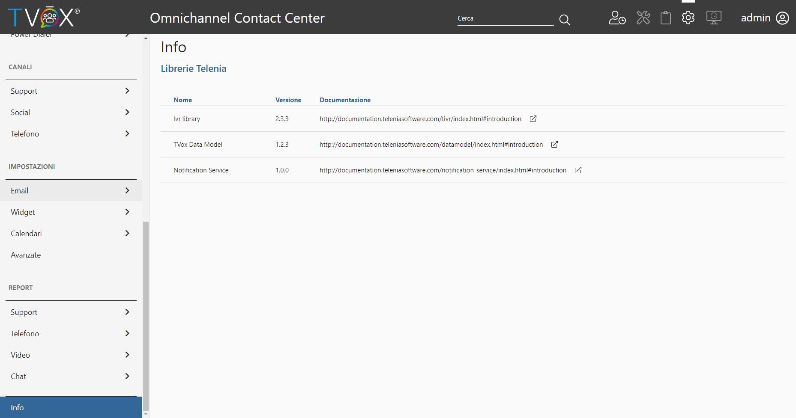

===========================================
Accedi ai tuoi dati con il TVox Data Model
===========================================

Il TVox Data Model definisce la struttura dei dati ed un metodo di accesso compatibile con i più comuni strumenti di reportistica e BI.

L'accesso ai dati è reso disponibile attraverso una Web API sfruttando un linguaggio d'interrogazione di nuova generazione (*GraphQL*) che garantisce all'utilizzatore un pieno controllo del dato richiesto.

Il TVox Data Model ti permette di costruire report e dashboard raccogliendo i dati di chiamate, video chiamate e chat per i tuoi servizi inbound.

Abilita e configura il TVox Data Model direttamente dall'apposita pagina sull'OCC nelle configurazioni avanzate.

.. image:: ../../images/datamodel/ConfigurazioneOCC.png

Documentazione tecnica
=======================

Per conoscere la versione di libreria "TVox Data Model" attualmente disponibile nel vostro sistema TVox, potete andare sull'OCC nella sezione info.
Conoscendo la vostra versione potete accedere alla |documentation_link|

.. |documentation_link| raw:: html

    <a href="http://documentation.teleniasoftware.com/datamodel/index.html#introduction"target="_blank"> Documentazione tecnica</a>