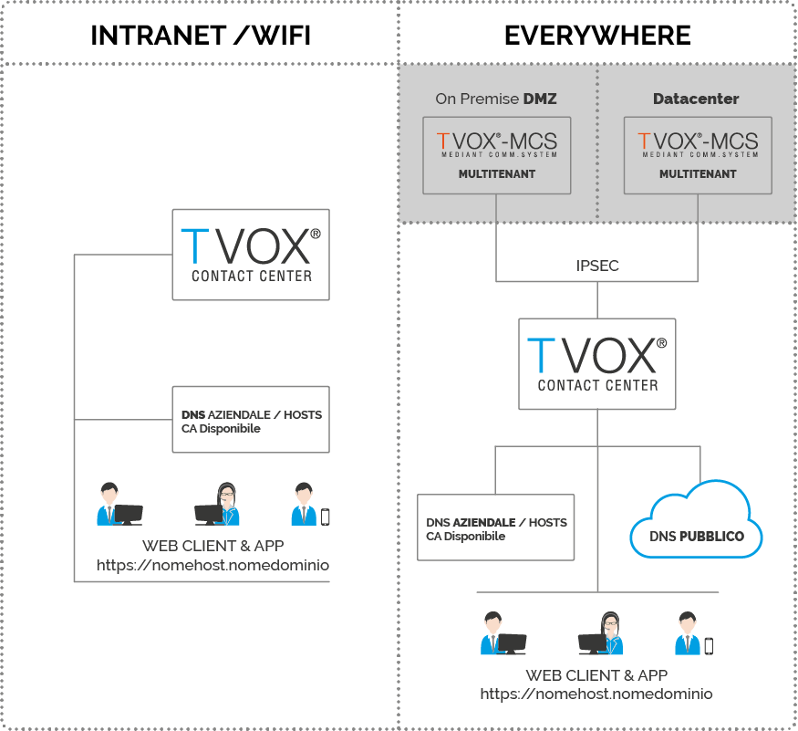

===============
Architettura
===============

| MCS può essere installato ovunque sia garantito un accesso ad Internet opportunamente configurato. Non deve avere alcuna visibilità diretta con TVox (Lan to Lan, va quindi prevista una DMZ qualora il TVox e l’MCS risiedano nella stessa sede). La connettività in uscita non deve transitare da un proxy.
| Per ulteriori dettagli :doc:`consultare la sezione Networking<Networking>`

.. note:: L'MCS deve disporre di un idirizzo IP pubblico statico in NAT 1:1 o direttamente attestato sulla scheda di rete.

|mcs_location|

----------
DNS e FQDN
----------

E' necessario avere un FQDN risolto come record A sull'IP pubblico utilizzato da TVox MCS. Questo FQDN sarà il dominio di management.

.. note:: Il dominio di management verà utilizzato per la configurazione iniziale di TVox MCS e per la gestione degli impianti ad esso collegati ed i relativi certificati SSL.

Ogni impianto TVox interconnesso a TVox MCS deve disporre di un proprio FQDN per l'accesso ai servizi. Ognuno di questi FQDN dovrà essere risolto pubblicamente come CNAME del dominio di management di TVox MCS.

.. tip:: Per fruire dei TVox WebClient e di TVox Team in modalità in-house è necessario configurare il DNS aziendale per far si che l'FQDN venga risolto con l'IP del TVox. In alternativa tutti gli accessi client e app saranno possibili solo in modalità smartworking.
