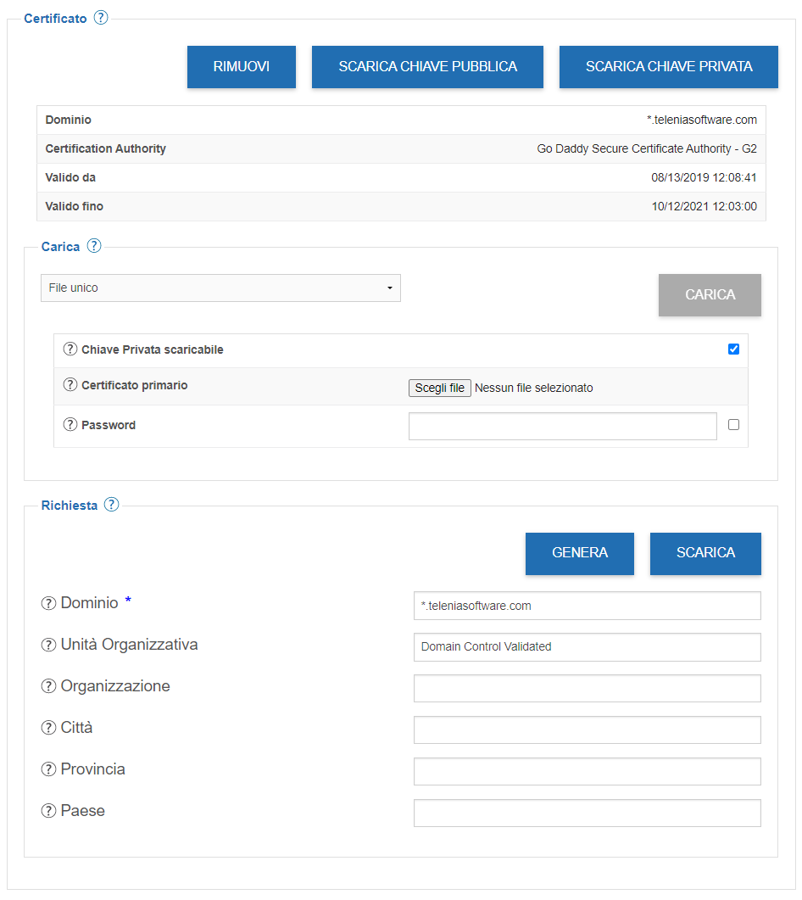
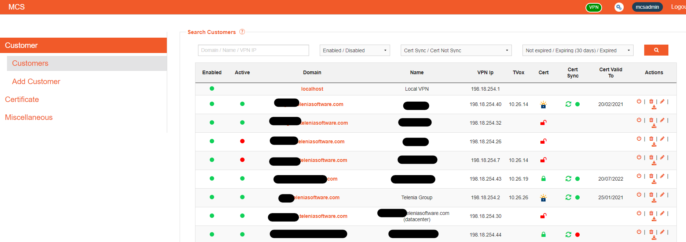
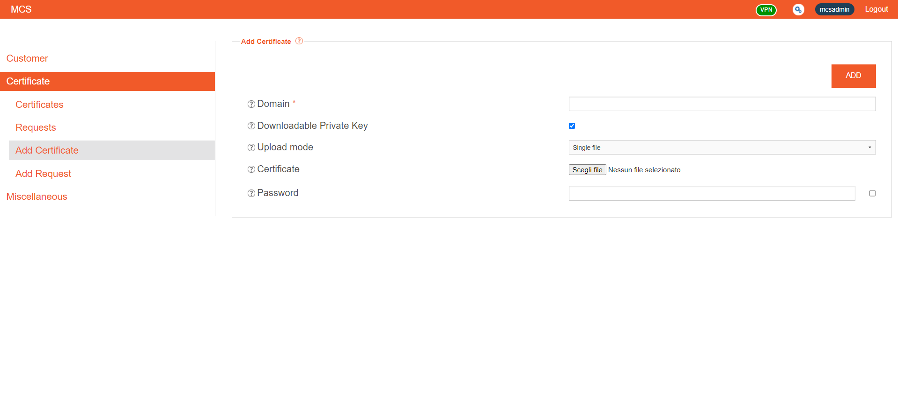

=========================
Gestione Certificati SSL
=========================

TVox e MCS presentano un pannello di controllo per caricare un certificato SSL con relativa chiave privata da utilizzare per il dominio di management della macchina.

|mcs_certificate_generation|

Il pannello di controllo di MCS presenta una gestione dei certificati SSL per i vari domini dei customer.

|mcs_customer_list|

La gestione può avvenire in due modi:

- integrazione con letsencrypt.org: è possibile attivare per ogni singolo FQDN l’utilizzo di certificati forniti automaticamente da Let’s Encrypt
- caricamento di certificati, sia nel formato singolo sotto-dominio che wildcard.

In entrambe le modalità i TVox possono essere configurati per scaricare automaticamente i certificati aggiornati dall’MCS. Questa funzionalità è fondamentale per il caso Let’s Encrypt poiché i certificati emessi hanno validità di 90 giorni.

|mcs_customer_certificate_upload|

.. important:: Anche per l'utilizzo di TVox Team in modalità in-house è **obbligatorio** che il TVox sia equipaggiato con un certificato firmato da una certification authority pubblica.