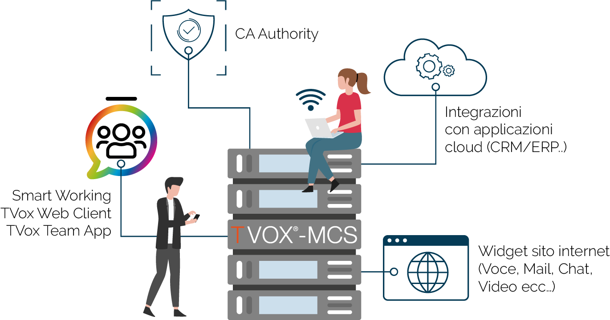

=========
Prodotto
=========

TVox **Mediant Communication System (MCS)** è la piattaforma che consente l'esposizione su internet dei servizi di comunicazione erogati da TVox Omnichannel Contact Center.

Come rappresentato in figura, MCS è necessario nel momento in cui si ha la necessità di:

* far lavorare in smartworking gli utenti TVox attraverso l'utilizzo di TVox Web Client e/o dell'applicazione mobile TVox Team
* fornire i certificati SSL necessari all'utilizzo di TVox Web Client e TVox Team
* integrare al TVox applicazioni aziendiali residenti in cloud
* utilizzare la widget del TVox integrata sul web

TVox MCS è multitenant, consentendo quindi di esporre su internet servizi erogati da più piattaforme TVox **fino ad un massimo di 250**. A TVox MCS deve essere associato un dominio pubblico e può essere installato su piattaforme server standard  o virtualizzate **purché compatibili con il sistema operativo Linux CentOS 7 64 Bit**, come ad esempio:

- **VMWare** (ESXi / vSphere) Richiesti Workstation v.7 e setup VMWare Tools 
- **Citrix System XEN Center** Installazione in modalità Hardware-assited Virtual Machine (no ParaVirtualization) 
- **Oracle VM Virtual Box** Richiesto setup extension pack

L’installazione di TVox MCS necessita di risorse che dipendono dalla consistenza degli utenti come indicato nella seguente tabella:

+-----------------+--------------------------------------------------------------+
| MCS Partner (a) |                            Risorse                           |
+-----------------+----------+------+-----------+--------+-----------------------+
|      Utenti     | CPU/Core |  RAM |   Disco   |   Eth  | Bandwith Internet (b) |
+-----------------+----------+------+-----------+--------+-----------------------+
|   Fino a 1000   |     4    | 8 Gb | 150GB SSD | 1 Gbit |       >=100Mb/s       |
+-----------------+----------+------+-----------+--------+-----------------------+
|   Fino a 10000  |     8    | 8 Gb | 150GB SSD |  1Gbit |       >=1000Mb/s      |
+-----------------+----------+------+-----------+--------+-----------------------+

Il sistema TVox MCS dovrà essere connesso a Internet con disponibilità di banda (massima) di circa 60 KB/s per ogni connessione attiva dei dispositivi (APP, UCC Web RTC e Widget).

.. warning:: Il servizio MCS non è ridondabile!
