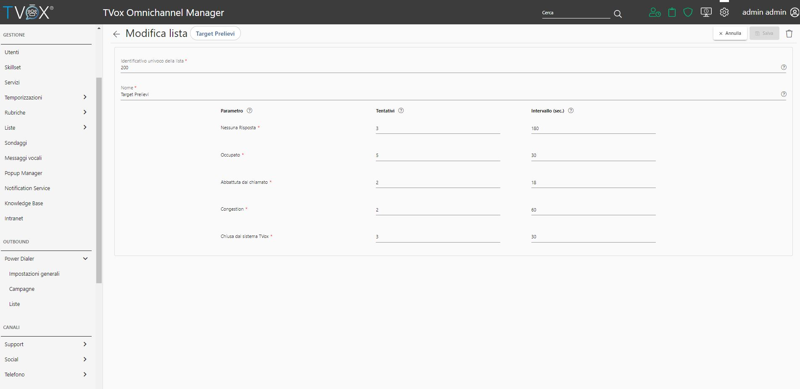
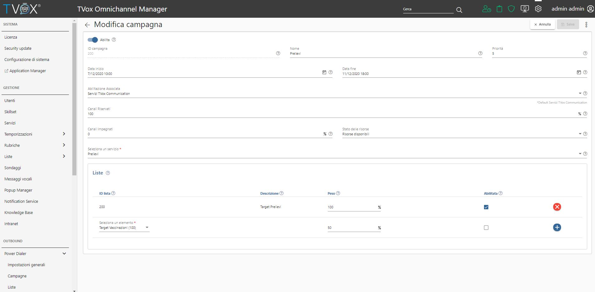
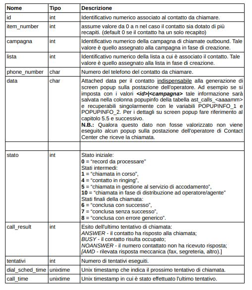
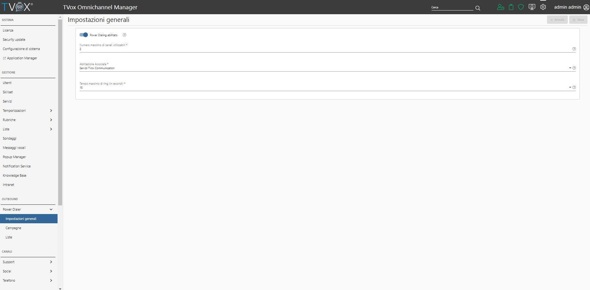

==============
Telemarketing
==============

Power Dialer è la funzionalità che ti permette la generazione automatica di chiamate telefoniche, realizzata per effettuare **campagne di Telemarketing** o notifiche telefoniche con messaggi audio preregistrati sotto forma di IVR (**notifiche telefoniche massive**)

Si tratta di un modulo che si aggiunge alle prestazioni di Contact Center: per ogni chiamata outbound generata, ottenuta risposta da parte del contatto cercato, la chiamata stessa viene presa in carico da un servizio di Contact Center che la accoda e la distribuisce analogamente a quanto avviene per le chiamate inbound.

La quantità di chiamate generate dal modulo di Power Dialer è condizionata dal numero di operatori disponibili e da variabili opportunamente configurate dall'amministratore del sistema.

---------

La gestione del Power Dialer prevede la definizione di:

- **una o più liste**

- **una o più campagne**

- **una tabella di frontiera**

---------

Liste
=====

Le liste contengono l'elenco di contatti da associare alle campagne. La configurazione di una lista consente di stabilire quando ripianificare una chiamata, 
in termini di **numero di ritentativi** e **timeout di attesa** tra un tentativo ed il successivo a fronte di mancata risposta.

Gli esiti gestiti dal sistema di Power Dialer sono i seguenti:

- **Nessuna Risposta**: nessuna risposta fornita dal contatto chiamato.

- **Occupato**: il contatto risulta occupato in un'altra conversazione.

- **Abbattuta dal chiamato**: il contatto ha risposto e successivamente riagganciato la chiamata prima di essere messo in contatto con il servizio associato alla campagna.

- **Congestion**: |tvox| non ha trovato canali telefonici disponibili per effettuare la chiamata o, in alternativa, il numero selezionato non è risultato valido.

- **Chiusa dal sistema TVox Communication**: il contatto ha risposto ed è rimasto in attesa di essere servito. Scaduto il tempo massimo di attesa sul servizio associato alla campagna, il contatto è stato riagganciato.

---------

Campagne
========

La Campagna individua un identificativo logico a cui associare la programmazione temporale di una particolare attività di chiamate, una indicazione di massima circa le **risorse da destinare all'attività**, e l'insieme dei contatti da chiamare che sono raggruppati per liste.

Oltre al periodo di validità, l'abilitazione per le chiamate in uscita ed il servizio di outbound a cui inoltrare le chiamate stesse, vanno definiti i seguenti parametri:

**Canali Riservati**: Numero massimo di canali telefonici in uscita utilizzati per la campagna corrente, calcolati come percentuale dei canali complessivamente configurati per il modulo Power Dialer.

**Canali Impegnati**: Numero di canali impegnati in uscita per la campagna corrente, calcolati come percentuale degli operatori presenti o disponibili per il servizio associato. Tale valore è comunque regolato dal parametro “Canali Riservati” che consente di stabilire un limite superiore per il numero di chiamate attive per la stessa campagna.

**Stato delle Risorse**: Stato delle risorse da considerare per l'ingaggio delle chiamate outbound automatiche:

- Risorse disponibili: agenti loggati al servizio che si trovano in stato Pronto

- Risorse presenti: agenti loggati al servizio

Operando su questo parametro, si può ottenere un tuning sulle prestazioni del modulo Power Dialer in termini di quantità di chiamate contemporaneamente iniziate per la campagna corrente.

.. note:: `ESEMPIO`: |br| Impostando il parametro **Stato delle Risorse** con il valore *0% su Risorse disponibili*, il sistema inizia una nuova chiamata a fronte di ogni operatore in stato *Pronto*. |br| Impostando lo stesso parametro con il valore *100% su Risorse disponibili*, invece, il sistema inizia due nuove chiamate a fronte di ogni operatore in stato *Pronto*.

---------

Tabella di Scambio
==================

La tabella di frontiera (denominata *ast_pd_interface*) diventa necessaria quando si vuole integrare il modulo Power Dialer con applicazioni esterne quali CRM o di Telemarketing.

Tale tabella dovrà contenere tanti record quanti sono i nominativi da contattare.

Per ogni record verranno riportati:

- l'identificativo numerico associato al chiaamnte (**id**)

- il numero da chiamare (**phone_number**)

- identificativo numerico della campagna (**campagna**)

- identificativo numerico della lista (**lista**)

- contenuto da riportare nell'invocazione di un eventuale popup a fronte della risposta della chiamata da parte dell' operatore (**data**)

Per poter inserire, modificare e cancellare i record della tabella di scambio *ast_pd_interface* è possibile accedere al database **ast_callcenter** con l'utenza dedicata (*user=tvox_pd password=tvox_pd*).

---------

Impostazioni generali
=====================

Le configurazioni generali da assegnare al modulo di Power Dialer prevedono che sia stabilito il livello di **occupazione delle linee (canali) disponibili** verso la rete PSTN o in generale verso il proprio carrier telefonico, **l'abilitazione telefonica** che |tvox| deve utilizzare per effettuare traffico outbound e il **tempo massimo di ring** che il sistema tiene in considerazione per gestire l'eventualiàt di mancata risposta.

---------

.. note:: La configurazione dei parametri disponibili per la gestione delle campagne di chiamate telefoniche deve garantire il rispetto delle norme emanate dal **Garante per la protezione dei dati personali** in materia di chiamate mute (rif. Gazzetta Ufficiale n. 79 del 4 aprile 2014).

Per attenersi a queste norme è indispensabile seguire alcuni suggerimenti:

– Evitare di richiamare con intervallo inferiore di una settimana quei contatti che, pur avendo risposto alla chiamata, non sono stati messi in comunicazione con gli operatori del Contact Center entro un breve intervallo di tempo (max 5 secondi). Per fare ciò è sufficiente gestire il parametro **Chiusa dal sistema TVox** disponibile nel dettaglio di ogni lista di contatti che viene associata alla campagna di chiamate.

– L'attesa dev'essere accompagnata da un messaggio oppure da una musica di attesa adeguata evitando assolutamente le attese silenziose. In questo caso è indispensabile che il servizio telefonico che si occupa dell'accodamento della chiamata agli operatori disponga della necessaria musica di attesa e che il timeout di coda sia nei termini richiesti inferiore alla decina di secondi.

---------

.. important:: Dopo aver completato la configurazione di liste e campagne e aver caricato i riferimenti ai contatti nella tabella di scambio, per poter dare inizio alla campagna stessa, è necessario effettuare un reset dei contatori agendo sul parametro **“Reset Statistiche”** della campagna di riferimento: tale operazione va ripetuta ogniqualvolta si modificano i dati contenuti nella tabella di scambio, in modo tale che gli indicatori di progressione siano riferiti ad una effettiva fotografia della tabella stessa. Il parametro **"Reset Statistiche"** si trova all'interno della campagna selezionando il menu a 3 puntini in alto a destra 

---------
Report ed esiti
===============

Il recupero dei dati relativo all'esito delle chiamate avviene direttamente via database, utilizzando la stessa utenza indicata per la configurazione della tabella di scambio.

Le tabelle interessate sono **ast_pd_history_<yyyymm>**, che hanno struttura analoga alla tabella ast_pd_interface, e le tabelle **ast_calls_outbound_<yyyymm>**.

